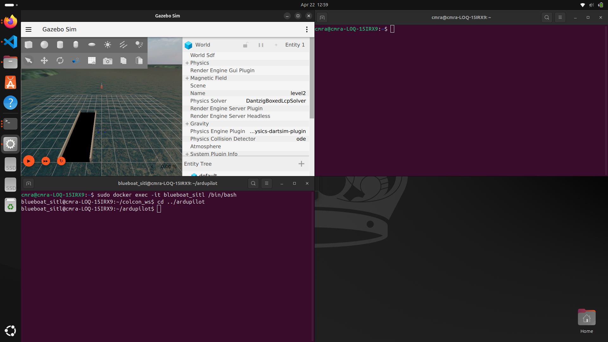
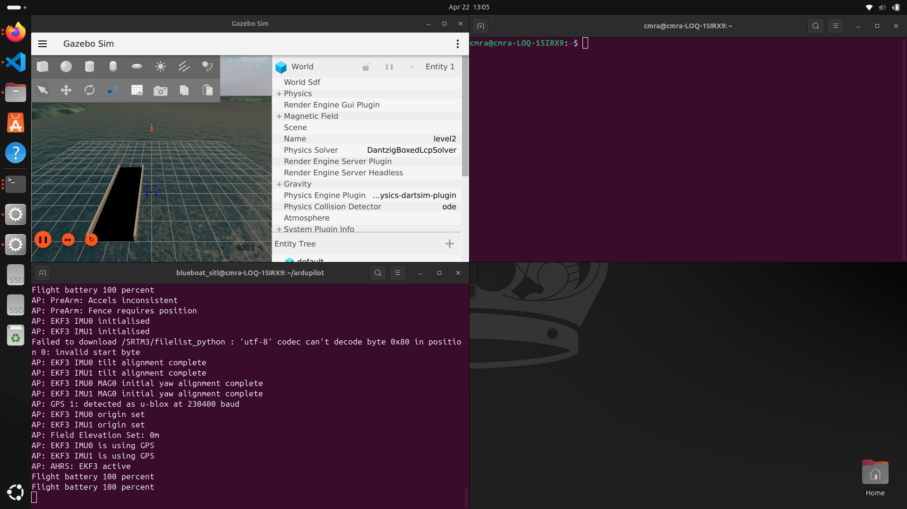
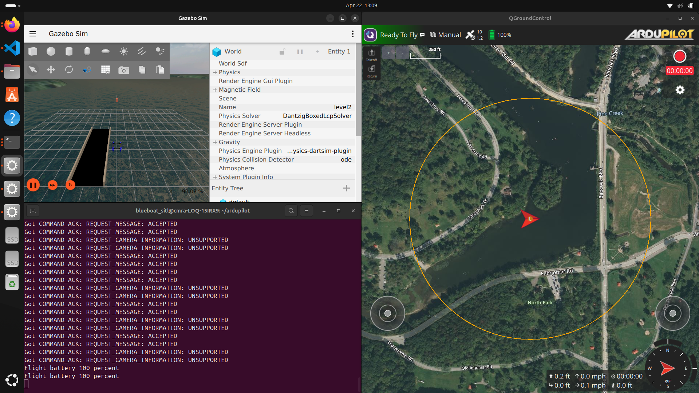
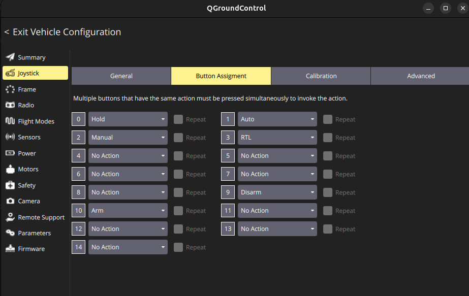
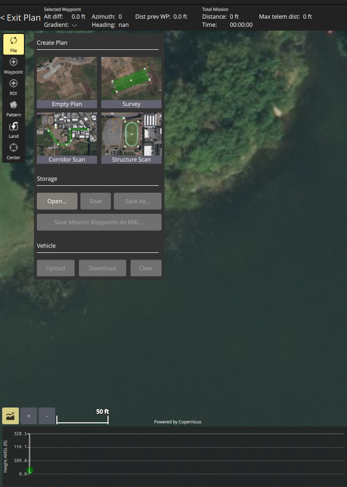
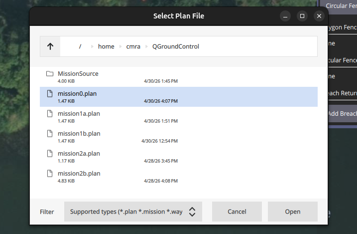
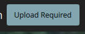
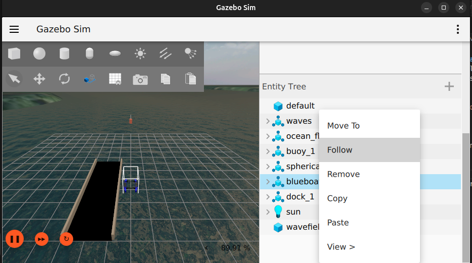

# Mission 0 - Mission 0: Software Setup and Manual Un-docking
Learn and practice the steps to start up the simulation. Understand the relationship between the simulator setup and the real-world hardware and software configuration. Verify the vehicle responds by manually driving it away from the dock, then back.

## Workstation preparation
1. Open 3 terminal windows. Press `win_key`, start typing `terminal`. Open the application when it appears. To open another terminal window, right-click the terminal app icon on the left toolbar. Select `New Window`.
2. Recommended: Use the layout below
   
    <b>T1</b> Gazebo terminal <br/>
    <b>T2</b> ArduPilot terminal <br />
    <b>T3</b> QGroundControl terminal <br />


## Starting the Docker container
Perform these steps in <b>T1 (Gazebo Terminal)</b>.
1. In <b>T1</b> navigate to the project's Docker folder. <br />
   <details>
   <summary>Linux Tip!</summary>
   
   Use keyboard shortcuts to copy and paste inside terminals. Press `ctl + shift + c` to copy and `ctl + shift + v` to paste.     You can also right-click and copy or paste if that is easier for you.
   </details>

   ```bash
    cd cmra_sim/gazebosim_blueboat_ardupilot_sitl/blueboat_sitl/docker/
    ```
   <details>
   <summary>What is the cd command?</summary>

   The cd (change directory) command is used in a terminal or command prompt to navigate between folders in a file system. It lets you move into a specific directory, go back to a previous one, or return to your home directory, depending on the path you provide.
   
   Wherever you navigate to is considered your working directory. Many commands in Linux run scripts. It is easier to launch scripts when your terminal's working directory is the same location as the script you want to launch. 

   In this step, we are changing our working directory to the project's Docker folder. This is where the Docker launch files live.
   

   </details>
2. In <b>T1</b> start the docker container by executing the run script. <b>This command will prompt you for a password. Ask the instructor for the password to continue.</b>
    ```bash
    sudo ./run.sh
    ```
   <details>
   <summary>What is the sudo ./run command?</summary>
   
   `sudo ./run.sh` means “run the `run.sh` shell script as the superuser. `sudo` gives the command elevated privileges, which this repo needs because `run.sh` launches Docker with privileged options, host networking, GPU access, device mounts, and X11 display forwarding for Gazebo, all of which often require admin-level access on Linux.

   A `.sh` file is a shell script: a text file full of terminal commands. When you run `./run.sh`, the `./` tells the shell to execute the script from the current folder, and this particular script is set up to run with Bash.

   In this project specifically, `run.sh` prepares X11 authentication, sets local paths for `gz_ws` and `SITL_Models`, and then starts a Docker container named `blueboat_sitl` with mounted volumes, host networking, NVIDIA GPU support, and the image `blueboat_sitl:latest`.

    You should see the following output:
    ```
    cmra@cmra-LOQ-15IRX9:~/cmra_sim/gazebosim_blueboat_ardupilot_sitl/blueboat_sitl/docker$ sudo ./run.sh
    [sudo] password for cmra: 
    xauth:  file /tmp/.docker.xauth does not exist
    blueboat_sitl@cmra-LOQ-15IRX9:~/colcon_ws$
    ```
   </details>


### Prepare Gazebo terminal
1. In <b>T1 (Gazebo Terminal)</b> navigate to the `gz_ws` folder
   ```bash
   cd ../gz_ws/
   ```
   <details>
   <summary>What does ../ mean?</summary>
   
   `../` means go back one folder in a path.

   For this step, we need to change our working directory to `gz_ws/` (Gazebo Workspace). This folder contains the scripts to launch Gazebo. When you launch Docker, it changes your working directory to Docker's colcon folder. We need to navigate back one folder to where `gz_ws/` lives. This is why we add `../` to the path.
   
   

   </details>

### Prepare ArduPilot terminal
In this section, you will enter the Docker container in <b>T2 (ArduPilot Terminal)</b>

1. In <b>T2</b> enter the docker container.
   ```bash
   sudo docker exec -it blueboat_sitl /bin/bash
   ```
   <details>
   <summary>What is the sudo docker exec -it blueboat_sitl /bin/bash command?</summary>

   `sudo docker exec -it blueboat_sitl /bin/bash` runs a command inside an already running Docker container with elevated privileges. The `sudo` ensures you have permission to interact with Docker, while `docker exec` tells Docker to execute the `blueboat_sitl` container environment.

   The `-it` flags make the session interactive (so you can type commands), and `/bin/bash` starts a Bash shell inside the container. In this repo’s context, this lets you “enter” the running `blueboat_sitl` simulation container to inspect files, run commands, or debug the Gazebo/ArduPilot SITL environment from the inside.

   

   </details>

2. In <b>T2</b> navigate to the ArduPilot folder
   ```bash
   cd ../ardupilot
   ```
   <details>
   <summary>Linux Tip!</summary>

   You can clear your terminal's log by using the `reset` command. This will delete all previous logs inside of your terminal. It will put you back into the same working directory.
   </details>
   
   
   
## Setup
Launch and run Gazebo Simulation
1. In <b>T1 (Gazebo Terminal)</b> Launch Gazebo
   ```bash
   ros2 launch move_blueboat mission0_sim.launch.py
   ```
   <details>
   <summary>What is the ros2 launch move_blueboat mission0_sim.launch.py command?</summary>

   `ros2 launch move_blueboat mission0_sim.launch.py` is a ROS 2 command used to start a predefined launch configuration for a robot or simulation. The `ros2 launch` command tells ROS 2 to run a launch file; `move_blueboat` is the ROS 2 package name, and `mission0_sim.launch.py` is the specific Python-based launch file that defines which nodes, parameters, and processes to start.

   In this project, running this command starts the BlueBoat Gazebo simulation for “mission0,” launching components like Gazebo, robot controllers, and any necessary ROS 2 nodes defined in that launch file, so the simulation environment is fully set up and ready to run.

   (optional) Layout the Gazebo application over top of <b>T1 (Gazebo Terminal)</b>.

   
   </details>
2. This will open the simulation window. Allow it to open and load.
<br /> 


### Launch ArduPilot
1. In <b>T2 (ArduPilot Terminal)</b> Launch ArduPilot
   ```bash
   sim_vehicle.py -v Rover -f gazebo-rover --model JSON \
      --add-param-file=../gz_ws/cmra_boat.params -w \
      -l 40.595009,-79.99974,0,0 \
      --out=udp:127.0.0.1:14550 --out=udp:127.0.0.1:14551
   ```
   <details>
   <summary>What is the sim_vehicle.py command?</summary>

   `sim_vehicle.py` is a script from ArduPilot for starting a Software-In-The-Loop (SITL) vehicle simulation. The flags here specify the vehicle type (`-v Rover`), the simulation environment (`-f gazebo-rover`), and options such as using a JSON model, starting the vehicle configuration with `--add-param-file`, and setting the starting GPS location with `-l`.

   The `--out=udp:127.0.0.1:14550` and `--out=udp:127.0.0.1:14551` parts send telemetry data over UDP to those ports on your local machine, which allows tools like QGroundControl or other ROS/bridge nodes to connect and interact with the simulated rover in the Gazebo environment.

   This launch script will open a MAVLink Command Console. We will not be using this, so you can minimize it. This console could serve as the robot's control system, but we will use QGroundControl instead.
   </details>



### Launch QGroundControl
1. In <b>T3 (QGroundControl Terminal)</b> navigate to the application folder
   ```bash
   cd QGroundControl/
   ```
2. In <b>T3</b> launch QGroundControl
   ```bash
   ./QGroundControl-x86_64.AppImage
   ```
   <details>
   <summary>What is the /QGroundControl-x86_64.AppImage command?</summary>

   `./QGroundControl-x86_64.AppImage` runs the QGroundControl application from the current directory. The `./` tells the terminal to execute the file locally, and an `.AppImage` is a self-contained Linux executable that doesn’t need installation.

   QGroundControl is a ground control station used to monitor and control drones/rovers. In this setup, it connects to the simulated vehicle (via the UDP ports in `sim_vehicle.py`) to display telemetry, maps, and cameras, and to allow you to send commands to the Gazebo simulation.

   (optional) Layout the QGroundControl application to cover the right half of your screen. We will need the most screen space for this application.

   

   </details>

### Configuring RC in QGroundControl
1. Plug the gamepad into the computer. (If using Logitech, set it to X mode on the back.)
2. Launch QGroundControl if you have not already.
3. Click the QGtroundControl menu button<br /> 
4. Click <b>Vehicle Configuration</b>
5. Click <b>Joystick</b>
6. Click <b>Buttons</b>
7. Assign the buttons to the following actions. <br /> 
   1. R1 - Arms boat
   2. L1 - Disarms boat
   3. A - Changes boat mode to hold
   4. X - Changes boat mode to manual
   5. B - Changes boat mode to auto
   6. Y - Changes boat mode to RTL
8. Click <b>Advanced</b>
9. Modify the following
    1.  Center stick is zero throttle
    2.  "Allow negative Thrust" is set to true (checked)
    3.  Enable further advanced settings is true (checked)
    4.  "Deadbands" is set to true (checked)
10. Click <b>Calibration</b>
11. Calibrate your RC
12. Press <b>Exit</b> to return to the map.


### Opening a plan in QGroundControl.
Each mission has a default program that needs to be opened and uploaded to the robot. These steps will use mission0.plan as an example. Other missions will instruct you to open the plan, but will not go into detail.
1. In QGroundControl click on the <b>Q</b> menu button. <br /> 
2. Click <b>Plan Flight</b>
3. Select <b>File</b> to open the menu. <br />
4. Click <b>Open</b> <br />
5. Open mission0.plan file. <br />
6. Upload your plan to ArduPilot by clicking Upload Required. <br />
7. Exit plan.

### Mission 0 plan
The mission zero plan provides you with two GEO fences. The first fence is where the dock is located in the simulated world. The second is where a buoy is located in the world. These GEO fences are set up to work with your robot's pathfinding logic. The pathfinder will try to avoid these zones as best as possible. If your robot enters one of these zones, it will automatically switch to Hold mode. 

###  Manual Un-docking
All steps should be performed inside QGroundControl unless otherwise stated.
<b>Arming in manual mode</b>

1. In Gazebo, right-click the blueboat in the Entity Tree. Click Follow. This will make the camera follow the Blueboat while it moves. <br />
2.  QGroundControl will have a green banner and state "Ready to Fly" as its status.
    1.  In <b>T2 (ArduPilot Terminal)</b>, confirm your robot is ready to be armed. You should see output similar to this.
        ```bash
        AP: EKF3 IMU0 tilt alignment complete
        AP: EKF3 IMU1 tilt alignment complete
        AP: EKF3 IMU0 MAG0 initial yaw alignment complete
        AP: EKF3 IMU1 MAG0 initial yaw alignment complete
        AP: GPS 1: detected as u-blox at 230400 baud
        AP: EKF3 IMU0 origin set
        AP: EKF3 IMU1 origin set
        AP: Field Elevation Set: 0m
        AP: EKF3 IMU0 is using GPS
        AP: EKF3 IMU1 is using GPS
        AP: AHRS: EKF3 active
        ```
3. Arm your robot by pressing the <b>Arm Button</b> on your RC. <br />
    <details>

    <summary>Failed to arm?</summary>

    Before the robot arms, it goes through a series of checks. If one of the checks fails, the robot fails to arm. In the simulator, it is most likely due to three causes.
    1. Your RC is throttling the robot and is not set in a neutral position. This will prevent EKF3 from activating. First try "flicking" the left stick down. This can reset it to neutral. If that does not work, try recalibrating your RC in vehicle configuration. If this fails, unplug the RC and manually arm it through QGroundControl before plugging it back in. 
    2. You did not wait until EKF3 is active. You'll see errors stating you did not set the AHRS mode.
    3. The computer is running too slow to consistently send sensor data to ArduPilot, and will take a little longer to calibrate its position and satisfy all of the arming checks.
        
    If this happens to you, wait until your QGroundControl status shows "Ready to Fly" in green, then rearm.

    </details>

4. Drive the boat, monitor the battery, and take note of the experience. There is a buoy marked on your map. Try to drive around it. What happens when you get too close? 
