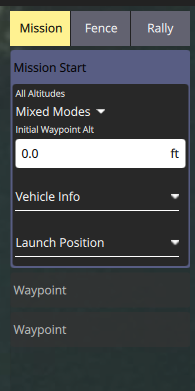
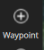
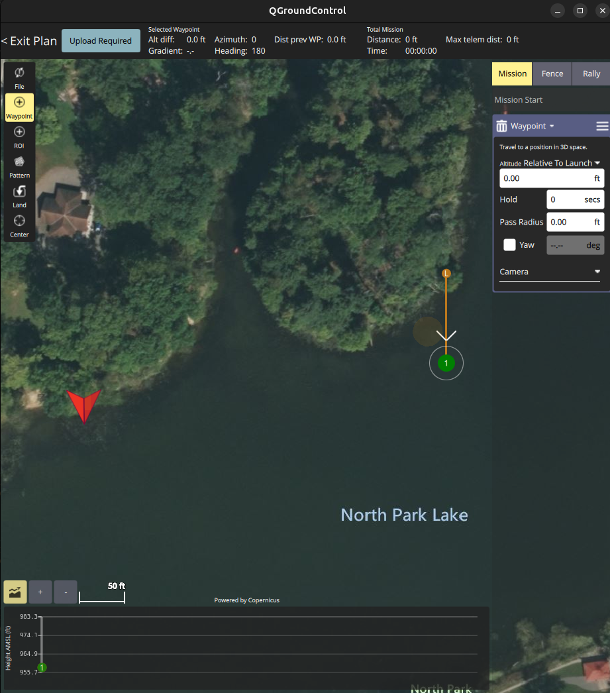
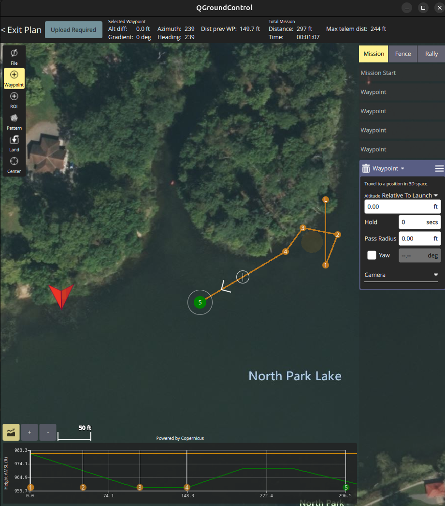
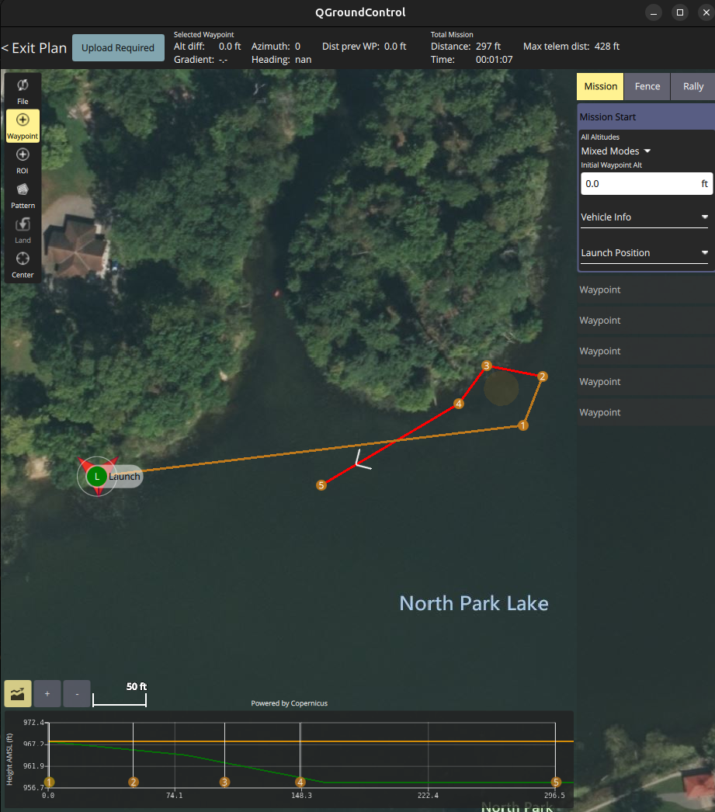
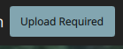
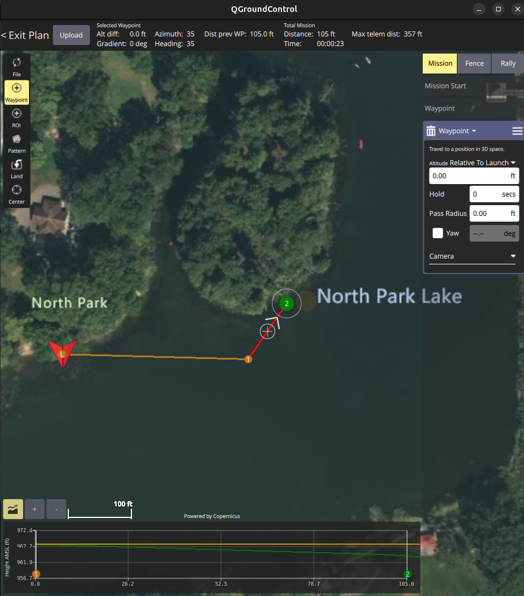

## Mission 1a: Buoy and Back
Program a simple autonomous mission to go around a buoy and return.

### Setup
1. Close Gazebo, ArduPilot, and QGroundControl and stop thier terminals.
2. Start/Restart the simulation with the following launch commands. Close QGroundControl
   1. Gazebo (Press play before next step)
   ```bash
   ros2 launch move_blueboat mission1a_sim.launch.py
   ```
   <details>
   <summary>Where is the Gazebo Application?</summary>

   From now on, missions will run gazebo headless. You must use the camera feed in QGroundControl to navigate.

   If you need to open Gazebo during the simulation. Refer to [Operating and Maintaing/Open Headless Gazebo Instance](https://github.com/cmroboticsacademy/gazebosim_blueboat_ardupilot_sitl/blob/main/README.md) for instructions.
   </details>

   2. ArduPilot
   ```bash
   sim_vehicle.py -v Rover -f gazebo-rover --model JSON \
      --add-param-file=../gz_ws/cmra_boat.params -w \
      -l 40.595009,-79.99974,0,180 \
      --out=udp:127.0.0.1:14550 --out=udp:127.0.0.1:14551
   ```
   3. QGroundControl
   ```
   ./QGroundControl-x86_64.AppImage
   ```
   4. Open and load <b>mission1a.plan</b> in QGroundControl.

### Mission1a plan
This plan is exactly the same as mission 0. There are two GEO Fences, one for the dock and one for the buoy.

### Creating a waypoint mission
1. Click the QGroundControl menu icon and select <b>Plan Flight</b>. <br />
2. Zoom in on your robot in the map area by scrolling or pressing the + or - buttons.
3. Select Mission Tab menu.<br /> 
4. Click the waypoint button in the left menu bar. <br />
5. Click an area on the map to add a waypoint . <br />
6. Place multiple waypoints (as many as you want) <br />
7. Adjust your Mission Start position.
   1. Click the Mission Start node on the right side menu. <br />
   2. Click "Launch Position" and set it to 0ft.
   3. Drag the green Launch point in line with your robot. <br />
8. Upload your mission to ArduPilot by clicking Upload Required <br />
9. Click <b>Exit Plan</b> after upload.

### Running a waypoint mission.
QGroundControl may automatically set your flight mode to auto or guided if you have a valid waypoint mission. However, if you arm your robot in auto near a fence (dock), the pathfinding algorithm will not generate a valid path to your way point. You must make some distance between you and the dock before changing to auto.
1. Use the RC to:
   1. Set flight mode to Manual (X)
   2. Arm the robot (R1)
2. Once armed, manually drive away from the dock.
3. Once you clear the dock, change the flight mode to Auto (B).
4. Your robot should now be carrying out the mission.
<details>

<summary>Robot enters buoy's exclusion zone.</summary>
If the robot enters the exclusion zone, it will automatically go into hold mode. You can switch the mode back to Auto if the robot drifts out of the zone. If the robot gets stuck in the zone, switch the flight mode to Manual, drive it out of the zone, then switch back to auto.
</details>

<details>
<summary>The robot is stuck outside of an exclusion zone.</summary>
Your robot might not have a valid path to follow because it is too close to an exclusion zone. This can happen when you are close to the dock or buoy. Change your flight mode to manual and drive away from the zone. When far enough away, change it back to Auto.
</details>


After the mission is complete, you can change your flight mode to RTL (Return to Launch). This will return directly to the launch point. You can also use SmartRTL, which will come back to the launch point the way it came.


## Mission 1b: Monitoring the vehicle
Proceed to implement a second simple-looking waypoint course independently. Monitor the vehicle during operation. The vehicle will experience course drift due to a current. Enable corrections in autonomy settings. Re-engage and complete mission.

### Setup
1. Stop the simulation (See [Stopping the simulation](https://github.com/cmroboticsacademy/gazebosim_blueboat_ardupilot_sitl/blob/main/ReadMe_CMRA.md) section)
2. Start the simulation with the following launch commands. Close QGroundControl before doing so.
   1. Gazebo (Press play before next step)
   ```bash
   ros2 launch move_blueboat mission1b_sim.launch.py
   ```
   2. ArduPilot
   ```bash
   sim_vehicle.py -v Rover -f gazebo-rover --model JSON \
      --add-param-file=../gz_ws/cmra_boat.params -w \
      -l 40.595009,-79.99974,0,0 \
      --out=udp:127.0.0.1:14550 --out=udp:127.0.0.1:14551
   ```
   3. QGroundControl
   ```bash
   ./QGroundControl-x86_64.AppImage 
   ```
   4. Open and load <b>mission2b.plan</b> in QGroundControl.

### Mission1a plan
This plan is exactly the same as mission 0. There are two GEO Fences, one for the dock and one for the buoy.

### Create and Run Mission
1. Create a waypoint program. Create a program so that your robot end's near the bouy. <br /><br />
2. Run your mission and monitor the robot. Take note of the changes now that there are waves.
3. Let your robot sit near the bouy for at least 5 minutes.

<details>
<summary>The robot will not arm.</summary>
Because of the waves, it takes a while for EFK3 to become active. Wait for the activation log before arming.
</details>

<details>
<summary>How to prevent the robot from drifting when stopped?</summary>
If you set your flight mode to "Hold," the robot will use its motors to stay in the same place. This is useful if there is a heavy current, like in this mission.
</details>
