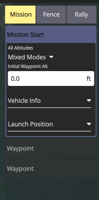
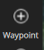
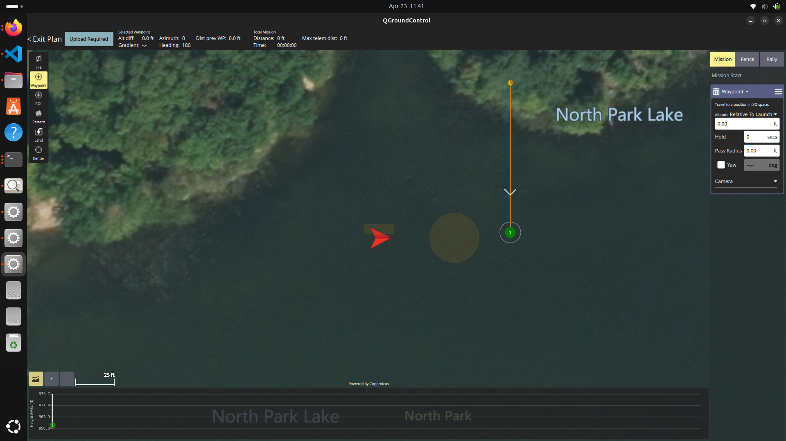
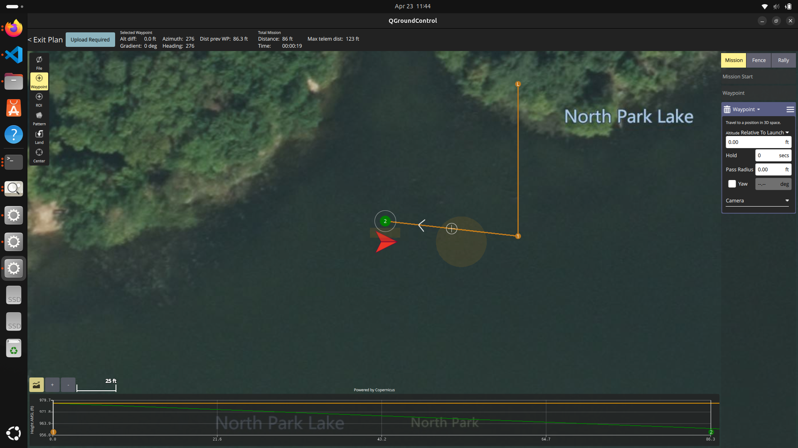
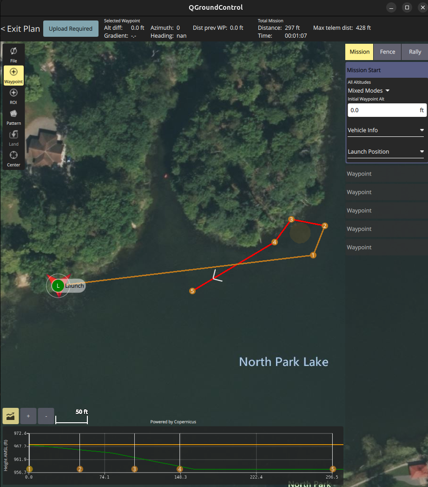
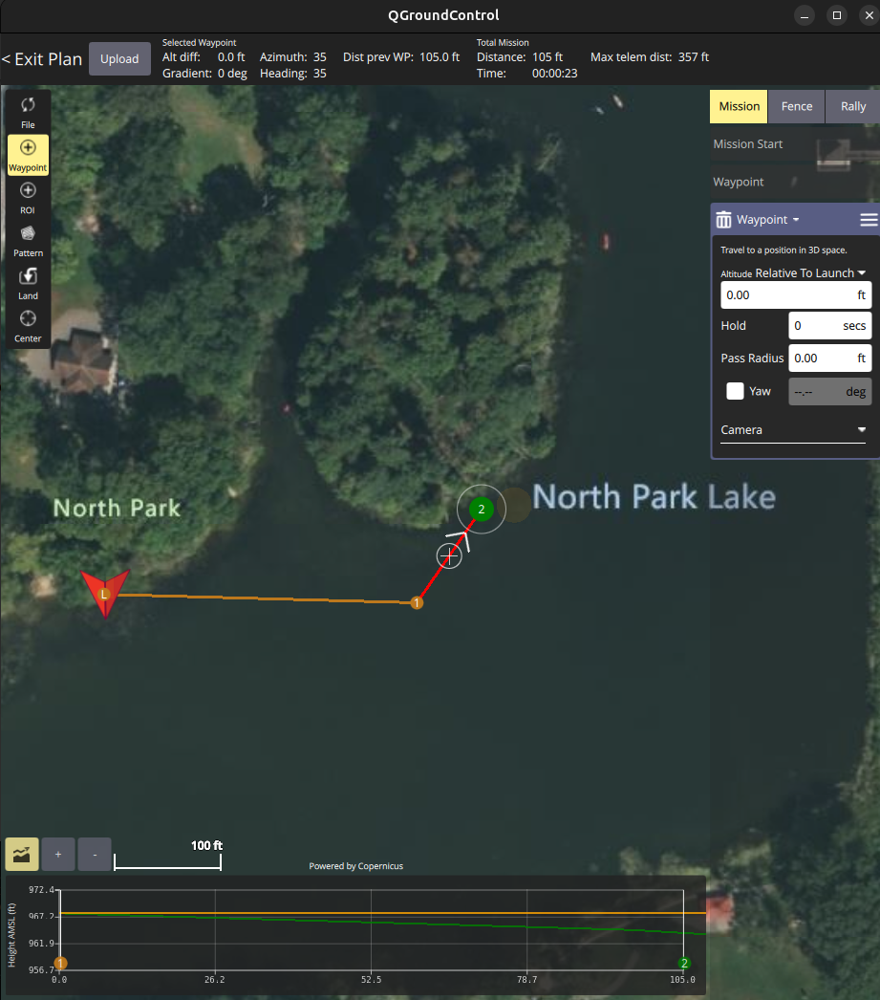

## Mission 1a: Buoy and Back
Program a simple autonomous mission to go around a buoy and return.

## Workstation preparation
1. Open 3 terminal windows. Press `win_key`, start typing `terminal`. Open the application when it appears. To open another terminal window, right-click the terminal app icon on the left toolbar. Select `New Window`.
2. Recommended: Use the layout below
   
    <b>T1</b> Gazebo terminal <br/>
    <b>T2</b> ArduPilot terminal <br />
    <b>T3</b> QGroundControl terminal <br />


## Starting the Docker container
Perform these steps in <b>T1 (Gazebo Terminal)</b>.
1. In <b>T1</b> navigate to the project's Docker folder. <br />
   <details>
   <summary>Linux Tip!</summary>
   
   Use keyboard shortcuts to copy and paste inside terminals. Press `ctl + shift + c` to copy and `ctl + shift + v` to paste.     You can also right-click and copy or paste if that is easier for you.
   </details>

   ```bash
    cd cmra_sim/gazebosim_blueboat_ardupilot_sitl/blueboat_sitl/docker/
    ```
   <details>
   <summary>What is the cd command?</summary>

   The cd (change directory) command is used in a terminal or command prompt to navigate between folders in a file system. It lets you move into a specific directory, go back to a previous one, or return to your home directory, depending on the path you provide.
   
   Wherever you navigate to is considered your working directory. Many commands in Linux run scripts. It is easier to launch scripts when your terminal's working directory is the same location as the script you want to launch. 

   In this step, we are changing our working directory to the project's Docker folder. This is where the Docker launch files live.
   

   </details>
2. In <b>T1</b> start the docker container by executing the run script. <b>This command will prompt you for a password. Ask the instructor for the password to continue.</b>
    ```bash
    sudo ./run.sh
    ```
   <details>
   <summary>What is the sudo ./run command?</summary>
   
   `sudo ./run.sh` means “run the `run.sh` shell script as the superuser. `sudo` gives the command elevated privileges, which this repo needs because `run.sh` launches Docker with privileged options, host networking, GPU access, device mounts, and X11 display forwarding for Gazebo, all of which often require admin-level access on Linux.

   A `.sh` file is a shell script: a text file full of terminal commands. When you run `./run.sh`, the `./` tells the shell to execute the script from the current folder, and this particular script is set up to run with Bash.

   In this project specifically, `run.sh` prepares X11 authentication, sets local paths for `gz_ws` and `SITL_Models`, and then starts a Docker container named `blueboat_sitl` with mounted volumes, host networking, NVIDIA GPU support, and the image `blueboat_sitl:latest`.

    You should see the following output:
    ```
    cmra@cmra-LOQ-15IRX9:~/cmra_sim/gazebosim_blueboat_ardupilot_sitl/blueboat_sitl/docker$ sudo ./run.sh
    [sudo] password for cmra: 
    xauth:  file /tmp/.docker.xauth does not exist
    blueboat_sitl@cmra-LOQ-15IRX9:~/colcon_ws$
    ```
   </details>


### Prepare Gazebo terminal
1. In <b>T1 (Gazebo Terminal)</b> navigate to the `gz_ws` folder
   ```bash
   cd ../gz_ws/
   ```
   <details>
   <summary>What does ../ mean?</summary>
   
   `../` means go back one folder in a path.

   For this step, we need to change our working directory to `gz_ws/` (Gazebo Workspace). This folder contains the scripts to launch Gazebo. When you launch Docker, it changes your working directory to Docker's colcon folder. We need to navigate back one folder to where `gz_ws/` lives. This is why we add `../` to the path.
   
   

   </details>

### Prepare ArduPilot terminal
In this section, you will enter the Docker container in <b>T2 (ArduPilot Terminal)</b>

1. In <b>T2</b> enter the docker container.
   ```bash
   sudo docker exec -it blueboat_sitl /bin/bash
   ```
   <details>
   <summary>What is the sudo docker exec -it blueboat_sitl /bin/bash command?</summary>

   `sudo docker exec -it blueboat_sitl /bin/bash` runs a command inside an already running Docker container with elevated privileges. The `sudo` ensures you have permission to interact with Docker, while `docker exec` tells Docker to execute the `blueboat_sitl` container environment.

   The `-it` flags make the session interactive (so you can type commands), and `/bin/bash` starts a Bash shell inside the container. In this repo’s context, this lets you “enter” the running `blueboat_sitl` simulation container to inspect files, run commands, or debug the Gazebo/ArduPilot SITL environment from the inside.

   

   </details>

2. In <b>T2</b> navigate to the ArduPilot folder
   ```bash
   cd ../ardupilot
   ```
   <details>
   <summary>Linux Tip!</summary>

   You can clear your terminal's log by using the `reset` command. This will delete all previous logs inside of your terminal. It will put you back into the same working directory.
   </details>
   
   
   
### Setup
1. Close Gazebo, ArduPilot, and QGroundControl and stop thier terminals.
2. Start/Restart the simulation with the following launch commands. Close QGroundControl
   1. Gazebo (Press play before next step)
   ```bash
   ros2 launch move_blueboat mission1a_sim.launch.py
   ```
   <details>
   <summary>Where is the Gazebo Application?</summary>

   From now on, missions will run gazebo headless. You must use the camera feed in QGroundControl to navigate.

   If you need to open Gazebo during the simulation. Refer to [Operating and Maintaing/Open Headless Gazebo Instance](https://github.com/cmroboticsacademy/gazebosim_blueboat_ardupilot_sitl/blob/main/README.md) for instructions.
   </details>

   2. ArduPilot
   ```bash
   sim_vehicle.py -v Rover -f gazebo-rover --model JSON \
      --add-param-file=../gz_ws/cmra_boat.params -w \
      -l 40.595009,-79.99974,0,180 \
      --out=udp:127.0.0.1:14550 --out=udp:127.0.0.1:14551
   ```
   3. QGroundControl
   ```
   ./QGroundControl-x86_64.AppImage
   ```
4. Open and load <b>mission1a.plan</b> in QGroundControl.

### Mission1a plan
This plan is exactly the same as mission 0. There are two GEO Fences, one for the dock and one for the buoy.

### Creating a waypoint mission
1. In QGroundControl, click on the Q menu button, and select <b>Plan Flight</b>. <br />
2. Zoom in on your robot in the map area by scrolling or pressing the + or - buttons.
3. Select <b>Mission</b> Tab menu.<br /> 
4. Click the <b>waypoint</b> button in the left menu bar. <br />
5. Click an area on the map to add a waypoint. <br />
6. Place multiple waypoints (as many as you want) <br />
7. Adjust your Mission Start position.
   1. Click the Mission Start node on the right side menu. <br />
   2. Click "Launch Position" and set it to 0ft.
   3. Drag the green Launch point in line with your robot. <br />
8. Upload your mission to ArduPilot by clicking Upload Required <br />
9. Click <b>Exit Plan</b> after upload.

### Running a waypoint mission.
QGroundControl may automatically set your flight mode to auto or guided if you have a valid waypoint mission. However, if you arm your robot in auto near a fence (dock), the pathfinding algorithm will not generate a valid path to your waypoint. You must maintain some distance from the dock before switching to Auto.
1. Use the RC to:
   1. Set flight mode to Manual (X)
   2. Arm the robot (R1)
2. Once armed, manually drive away from the dock.
3. Once you clear the dock, change the flight mode to Auto (B).
4. Your robot should now be carrying out the mission.
<details>

<summary>Robot enters buoy's exclusion zone.</summary>
If the robot enters the exclusion zone, it will automatically go into hold mode. You can switch the mode back to Auto if the robot drifts out of the zone. If the robot gets stuck in the zone, switch the flight mode to Manual, drive it out of the zone, then switch back to auto.
</details>

<details>
<summary>The robot is stuck outside of an exclusion zone.</summary>
Your robot might not have a valid path to follow because it is too close to an exclusion zone. This can happen when you are close to the dock or buoy. Change your flight mode to manual and drive away from the zone. When far enough away, change it back to Auto.
</details>


After the mission is complete, you can change your flight mode to RTL (Return to Launch). This will return directly to the launch point. You can also use SmartRTL, which will come back to the launch point the way it came.


## Mission 1b: Monitoring the vehicle
Proceed to implement a second simple-looking waypoint course independently. Monitor the vehicle during operation. The vehicle will experience course drift due to a current. Enable corrections in autonomy settings. Re-engage and complete the mission.

### Setup
1. Stop the simulation (See [Stopping the simulation](https://github.com/cmroboticsacademy/gazebosim_blueboat_ardupilot_sitl/blob/main/ReadMe_CMRA.md) section)
2. Start the simulation with the following launch commands.
   1. Gazebo (Press play before next step)
   ```bash
   ros2 launch move_blueboat mission1b_sim.launch.py
   ```
   2. ArduPilot
   ```bash
   sim_vehicle.py -v Rover -f gazebo-rover --model JSON \
      --add-param-file=../gz_ws/cmra_boat.params -w \
      -l 40.595009,-79.99974,0,0 \
      --out=udp:127.0.0.1:14550 --out=udp:127.0.0.1:14551
   ```
   3. QGroundControl
   ```bash
   ./QGroundControl-x86_64.AppImage 
   ```
4. Open and load <b>mission1b.plan</b> in QGroundControl.

### Mission1b plan
This plan is exactly the same as mission 0. There are two GEO Fences, one for the dock and one for the buoy.

### Create and Run Mission
1. Create a waypoint program. Create a program so that your robot ends near the buoy. <br />
2. Run your mission and monitor the robot. Take note of the changes now that there are waves.
3. Let your robot sit near the buoy for at least 5 minutes.

<details>
<summary>The robot will not arm.</summary>
Because of the waves, it takes a while for EFK3 to become active. Wait for the activation log before arming.
</details>

<details>
<summary>How to prevent the robot from drifting when stopped?</summary>
If you set your flight mode to "Hold," the robot will use its motors to stay in the same place. This is useful if there is a heavy current, like in this mission.
</details>
