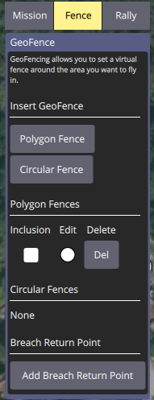
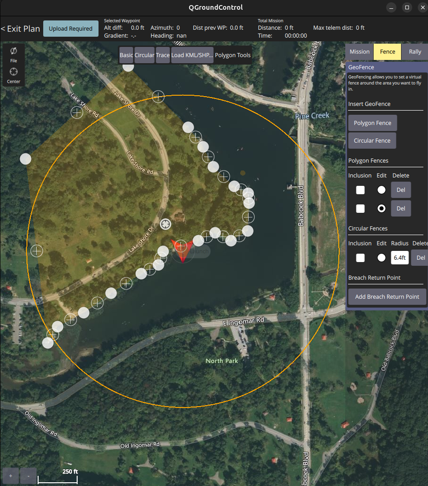
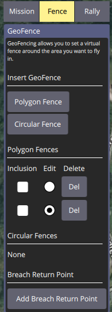
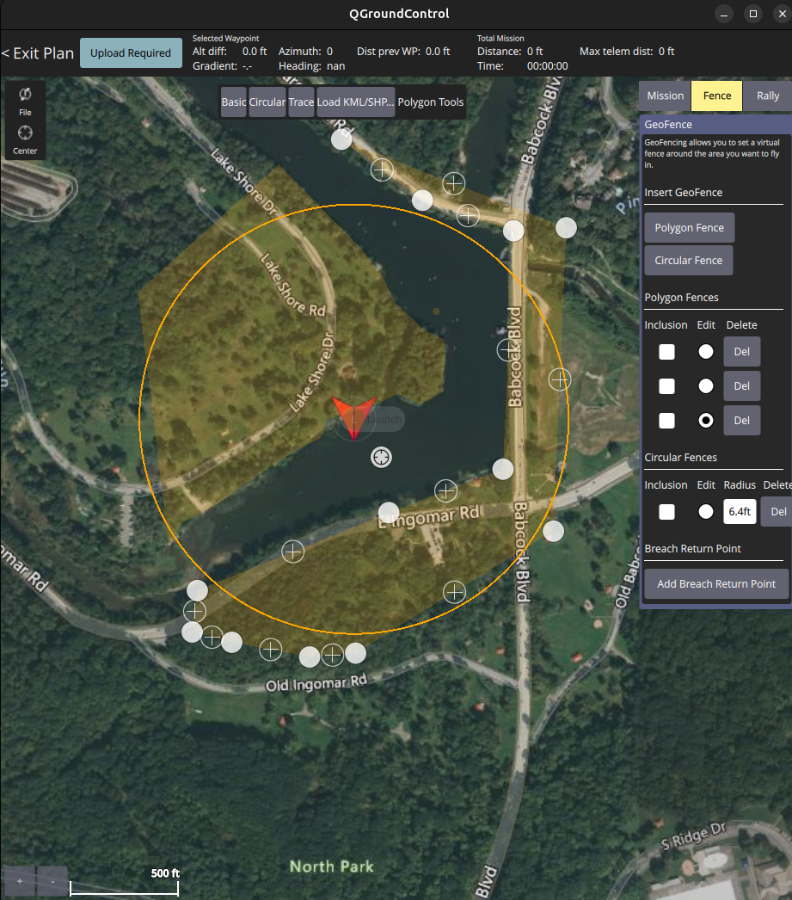
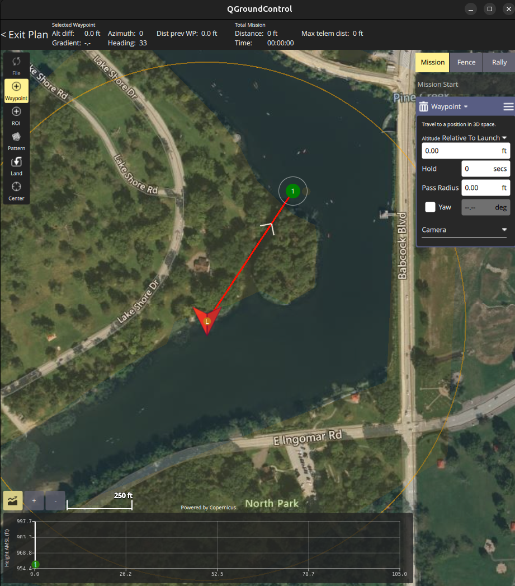
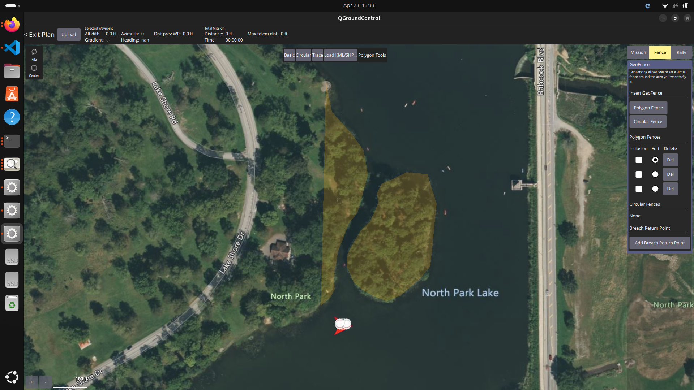
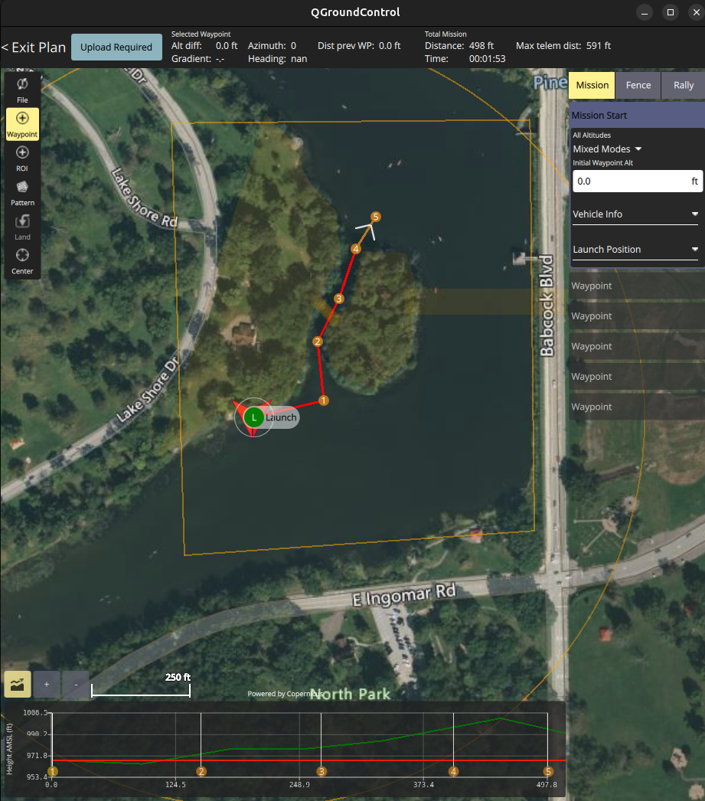

## Mission 2a: Channel
Plan a mission sequence around an island. Use exclusion zones to keep the vehicle away from known navigational hazards.

### Setup
1. Stop the simulation (See [Stopping the simulation](https://github.com/cmroboticsacademy/gazebosim_blueboat_ardupilot_sitl/blob/main/ReadMe_CMRA.md) section)
2. Start the simulation with the following launch commands. Close QGroundControl before doing so.
   1. Gazebo (Press play before next step)
   ```
   ros2 launch move_blueboat level3_sim.launch.py
   ```
   2. ArduPilot
   ```
   sim_vehicle.py -v Rover -f gazebo-rover --model JSON \
      --add-param-file=../gz_ws/cmra_boat.params -w \
      -l 40.594988,-79.999149,0,0 \
      --out=udp:127.0.0.1:14550 --out=udp:127.0.0.1:14551
   ```
   3. QGroundControl
   ```
   ./QGroundControl-x86_64.AppImage /home/cmra/Documents/QGroundControl/Missions/level3.plan
   ```

### Creating a GEO Fence
1. Create a plan by going to Plan Flight in QGroundControl.
2. Zoom your map out so you can see most of the lake.
3. Click "Fence" on the left menu

4. Click Polygon Fence
5. Fence off the west coast of the lake with the fence.

6. Uncheck "Inclusion" for this fence.

7. Add another Polygon Fence for the east coast, and uncheck "Inclusion."


### Create and run a waypoint mission.
1. Click Mission in the Plan Flight View.
2. Click Waypoint to add waypoints.
3. Use a single waypoint to navigate to the other side of the lake, and adjust the launch position.

4. Upload the mission.
5. Exit "Plan Flight."
6. Run the waypoint mission.
7. Monitor the robot. You may need to manually take over if the robot gets stuck.

## Mission 2b: Narrow Channel
Recognize, plan for, and run a mission in which a portion of the route is known to be too narrow and may require manual control

### Setup
1. Stop the simulation (See [Stopping the simulation](https://github.com/cmroboticsacademy/gazebosim_blueboat_ardupilot_sitl/blob/main/ReadMe_CMRA.md) section)
2. Start the simulation with the following launch commands. Close QGroundControl before doing so.
   1. Gazebo (Press play before next step)
   ```
   ros2 launch move_blueboat level4_sim.launch.py
   ```
   2. ArduPilot
   ```
   sim_vehicle.py -v Rover -f gazebo-rover --model JSON \
      --add-param-file=../gz_ws/cmra_boat.params -w \
      -l 40.594988,-79.999149,0,0 \
      --out=udp:127.0.0.1:14550 --out=udp:127.0.0.1:14551
   ```
   3. QGroundControl
   ```
   ./QGroundControl-x86_64.AppImage /home/cmra/Documents/QGroundControl/Missions/level4.plan
   ```

### Create GEO Fence
1. Create a plan with two Polygon GEO Fences. Position them so you can drive through the narrow channel between the west coast and the island.
   

### Create waypoint program
1. Create a waypoint mission to navigate through the channel.
    
2. Upload it to the robot.
3. Exit "Plan Flight."

### Run the mission
1. Run the mission and monitor the robot.
2. When your robot cannot path through the buoys, change the flight mode to Manual and enter the buoy's exclusion zone.
3. When you enter, the flight mode will automatically switch to hold for safety. Switch it back to Manual and drive through.
4. When you exit the zone, change the flight mode back to Auto.
5. After your mission is complete, try to come back through the channel.
straight