## Mission 2a: Channel
Plan a mission sequence around an island. Use exclusion zones to keep the vehicle away from known navigational hazards.

## Workstation preparation
1. Open 3 terminal windows. Press `win_key`, start typing `terminal`. Open the application when it appears. To open another terminal window, right-click the terminal app icon on the left toolbar. Select `New Window`.
2. Recommended: Use the layout below
   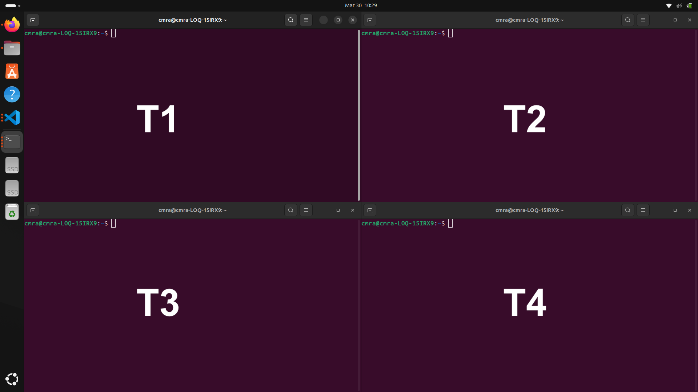
    <b>T1</b> Gazebo terminal <br/>
    <b>T2</b> ArduPilot terminal <br />
    <b>T3</b> QGroundControl terminal <br />


## Starting the Docker container
Perform these steps in <b>T1 (Gazebo Terminal)</b>.
1. In <b>T1</b> navigate to the project's Docker folder. <br />
   <details>
   <summary>Linux Tip!</summary>
   
   Use keyboard shortcuts to copy and paste inside terminals. Press `ctl + shift + c` to copy and `ctl + shift + v` to paste.     You can also right-click and copy or paste if that is easier for you.
   </details>

   ```bash
    cd cmra_sim/gazebosim_blueboat_ardupilot_sitl/blueboat_sitl/docker/
    ```
   <details>
   <summary>What is the cd command?</summary>

   The cd (change directory) command is used in a terminal or command prompt to navigate between folders in a file system. It lets you move into a specific directory, go back to a previous one, or return to your home directory, depending on the path you provide.
   
   Wherever you navigate to is considered your working directory. Many commands in Linux run scripts. It is easier to launch scripts when your terminal's working directory is the same location as the script you want to launch. 

   In this step, we are changing our working directory to the project's Docker folder. This is where the Docker launch files live.
   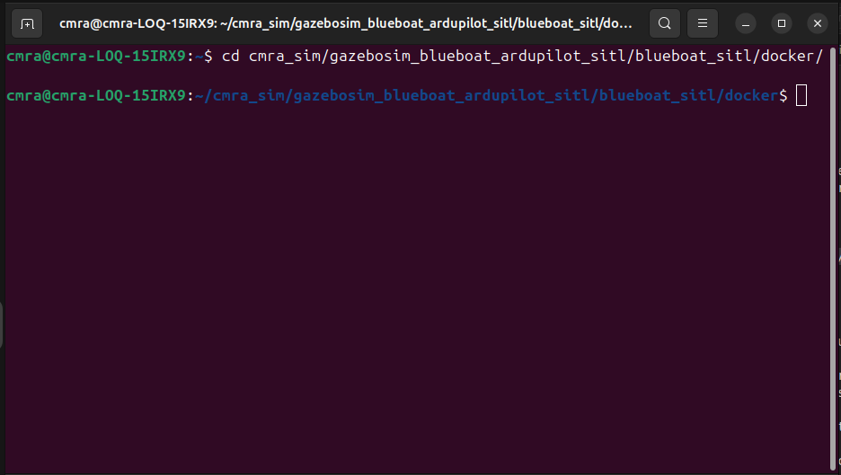

   </details>
2. In <b>T1</b> start the docker container by executing the run script. <b>This command will prompt you for a password. Ask the instructor for the password to continue.</b>
    ```bash
    sudo ./run.sh
    ```
   <details>
   <summary>What is the sudo ./run command?</summary>
   
   `sudo ./run.sh` means “run the `run.sh` shell script as the superuser. `sudo` gives the command elevated privileges, which this repo needs because `run.sh` launches Docker with privileged options, host networking, GPU access, device mounts, and X11 display forwarding for Gazebo, all of which often require admin-level access on Linux.

   A `.sh` file is a shell script: a text file full of terminal commands. When you run `./run.sh`, the `./` tells the shell to execute the script from the current folder, and this particular script is set up to run with Bash.

   In this project specifically, `run.sh` prepares X11 authentication, sets local paths for `gz_ws` and `SITL_Models`, and then starts a Docker container named `blueboat_sitl` with mounted volumes, host networking, NVIDIA GPU support, and the image `blueboat_sitl:latest`.

    You should see the following output:
    ```
    cmra@cmra-LOQ-15IRX9:~/cmra_sim/gazebosim_blueboat_ardupilot_sitl/blueboat_sitl/docker$ sudo ./run.sh
    [sudo] password for cmra: 
    xauth:  file /tmp/.docker.xauth does not exist
    blueboat_sitl@cmra-LOQ-15IRX9:~/colcon_ws$
    ```
   </details>


### Prepare Gazebo terminal
1. In <b>T1 (Gazebo Terminal)</b> navigate to the `gz_ws` folder
   ```bash
   cd ../gz_ws/
   ```
   <details>
   <summary>What does ../ mean?</summary>
   
   `../` means go back one folder in a path.

   For this step, we need to change our working directory to `gz_ws/` (Gazebo Workspace). This folder contains the scripts to launch Gazebo. When you launch Docker, it changes your working directory to Docker's colcon folder. We need to navigate back one folder to where `gz_ws/` lives. This is why we add `../` to the path.
   
   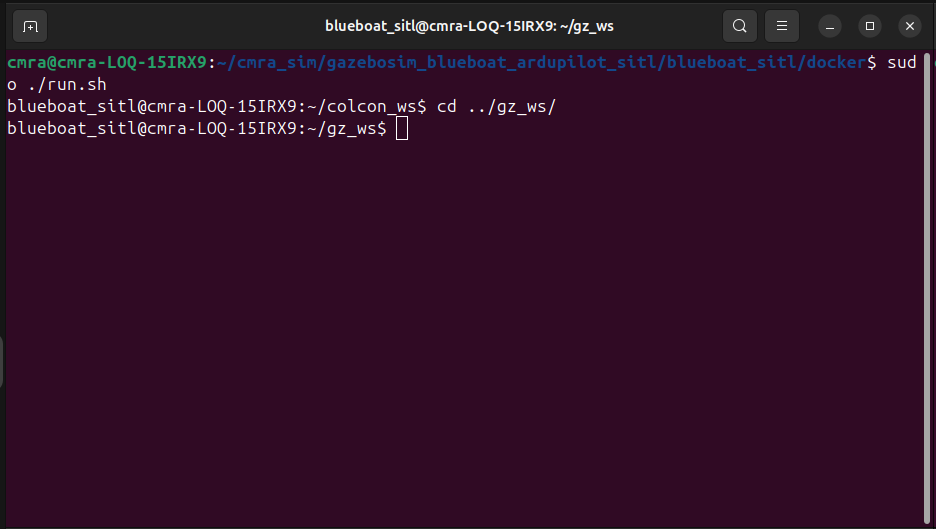

   </details>

### Prepare ArduPilot terminal
In this section, you will enter the Docker container in <b>T2 (ArduPilot Terminal)</b>

1. In <b>T2</b> enter the docker container.
   ```bash
   sudo docker exec -it blueboat_sitl /bin/bash
   ```
   <details>
   <summary>What is the sudo docker exec -it blueboat_sitl /bin/bash command?</summary>

   `sudo docker exec -it blueboat_sitl /bin/bash` runs a command inside an already running Docker container with elevated privileges. The `sudo` ensures you have permission to interact with Docker, while `docker exec` tells Docker to execute the `blueboat_sitl` container environment.

   The `-it` flags make the session interactive (so you can type commands), and `/bin/bash` starts a Bash shell inside the container. In this repo’s context, this lets you “enter” the running `blueboat_sitl` simulation container to inspect files, run commands, or debug the Gazebo/ArduPilot SITL environment from the inside.

   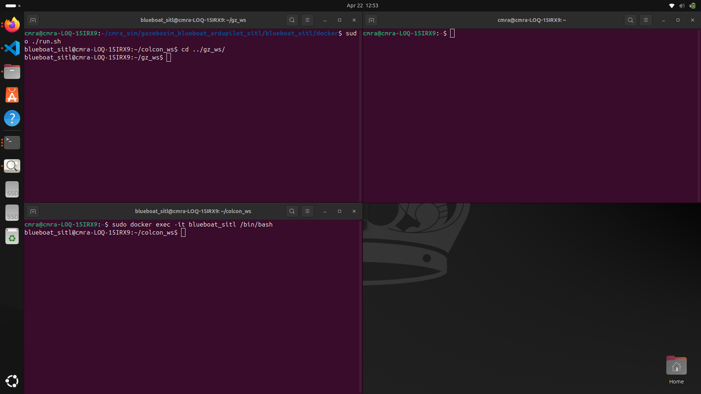

   </details>

2. In <b>T2</b> navigate to the ArduPilot folder
   ```bash
   cd ../ardupilot
   ```
   <details>
   <summary>Linux Tip!</summary>

   You can clear your terminal's log by using the `reset` command. This will delete all previous logs inside of your terminal. It will put you back into the same working directory.
   </details>
   
   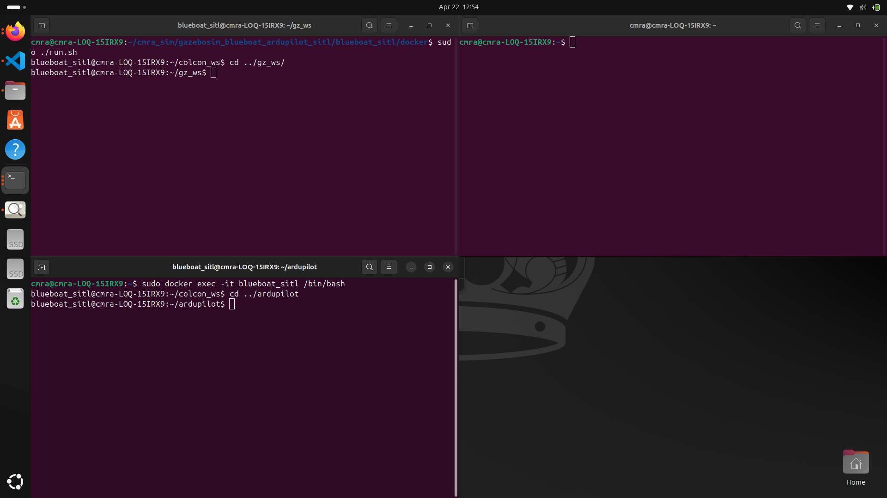

   
### Setup
Start the simulation with the following launch commands.
   1. <b>T1 Gazebo Terminal</b>
   ```bash
   ros2 launch move_blueboat mission2a_sim.launch.py
   ```
   2. <b>T2 ArduPilot Terminal</b>
   ```bash
   sim_vehicle.py -v Rover -f gazebo-rover --model JSON \
      --add-param-file=../gz_ws/cmra_boat.params -w \
      -l 40.595009,-79.99974,0,0 \
      --out=udp:127.0.0.1:14550 --out=udp:127.0.0.1:14551
   ```
   3. Change to the QGroundControl Directory in <b>T3 (QGroundControl Terminal)</b>
   ```
   cd QGroundControl/
   ```
   4. Launch QGroundControl in <b>T3</b>
   ```bash
   ./QGroundControl-x86_64.AppImage
   ```
   5. Open and load <b>mission2a</b> in QGroundControl.

### Mission2a plan
There are two GEO Fences, one for the dock and one for the buoy. The buoy is located North of the island.

### Creating a GEO Fence
1. Create a plan by going to Plan Flight in QGroundControl.
2. Zoom your map out so you can see most of the lake.
3. Click <b>Fence</b> on the right menu <br /> 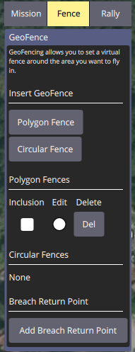
4. Click <b>Polygon Fence</b>
5. Fence off the west coast of the lake with the fence. <br /> 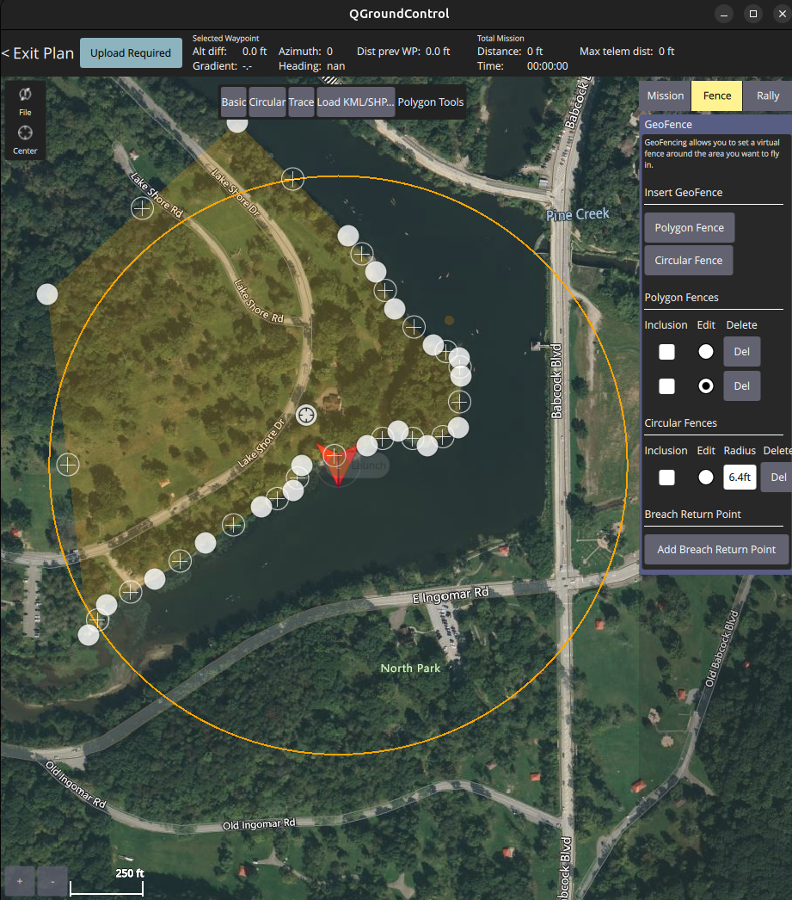
6. Uncheck <b>Inclusion</b> for this fence. <br /> 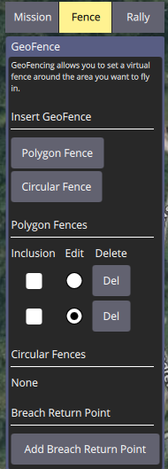
7. Add another Polygon Fence for the east coast, and uncheck <b>Inclusion</b>. <br /> 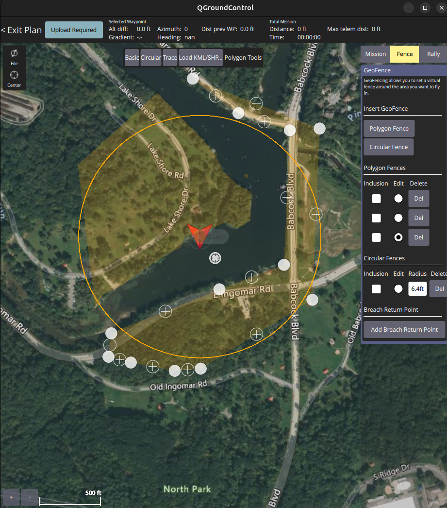

### Create and run a waypoint mission.
1. Click <b>Mission</b> in the Plan Flight View.
2. Click <b>Waypoint</b> to add waypoints.
3. Use a single waypoint to navigate to the other side of the lake, and adjust the launch position. <br />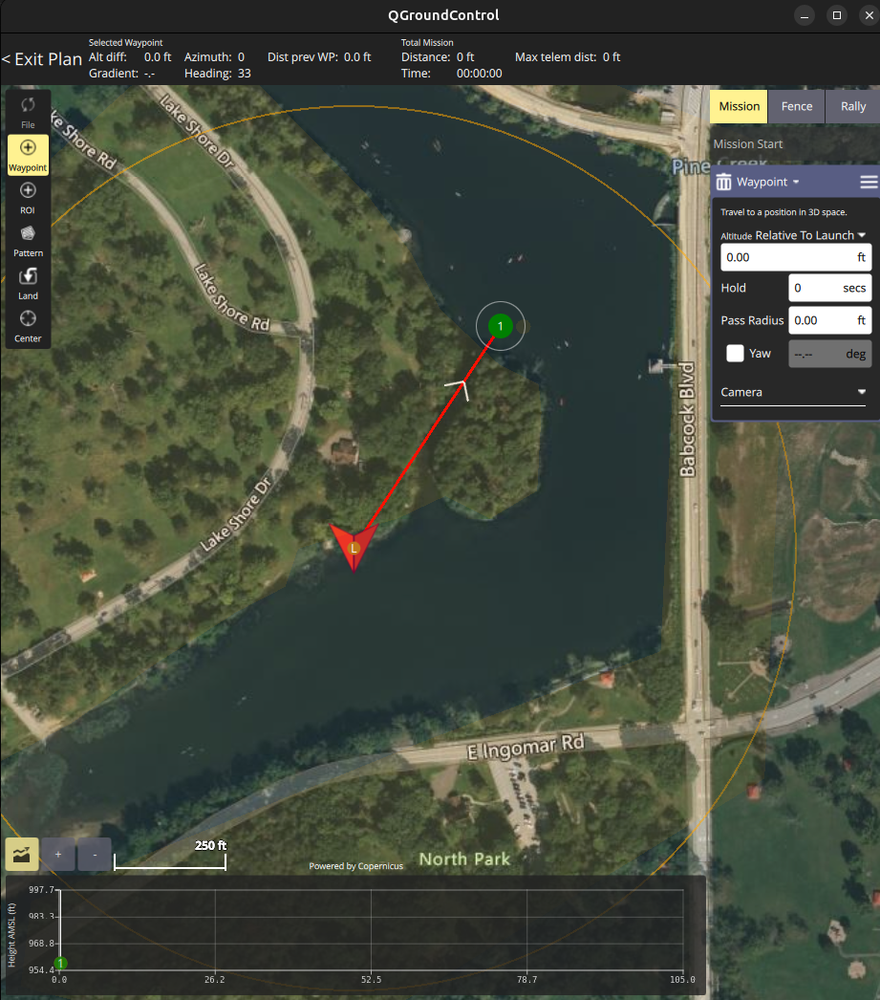
4. Upload the mission.
5. Exit Plan
6. Manually drive away from the dock.
7. Run the waypoint mission.
8. Monitor the robot. You may need to manually take over if the robot gets stuck.

## Mission 2b: Narrow Channel
Recognize, plan for, and run a mission in which a portion of the route is known to be too narrow and may require manual control

### Setup
1. Stop the simulation (See [Stopping the simulation](https://github.com/cmroboticsacademy/gazebosim_blueboat_ardupilot_sitl/blob/main/ReadMe_CMRA.md) section)
2. Start the simulation with the following launch commands.
   1. Gazebo 
   ```
   ros2 launch move_blueboat mission2b_sim.launch.py
   ```
   2. ArduPilot
   ```bash
   sim_vehicle.py -v Rover -f gazebo-rover --model JSON \
      --add-param-file=../gz_ws/cmra_boat.params -w \
      -l 40.595009,-79.99974,0,0 \
      --out=udp:127.0.0.1:14550 --out=udp:127.0.0.1:14551
   ```
   3. QGroundControl
   ```
   ./QGroundControl-x86_64.AppImage /home/cmra/Documents/QGroundControl/Missions/level4.plan
   ```
   4. Open and Load <b>mission2b.plan</b> in QGroundControl.

### Mission2b plan
This plan provides you with two different types of GEO Fences.
It provides exclusion zones for the dock. There is also an exclusion zone blocking the lake's main route, forcing us to navigate the narrow channel. The channel has a line of buoys that must be navigated in Manual mode.

This plan also provides an inclusion zone. A zone marked for inclusion means a robot cannot path outside of the zone. This prevents us from having to GEO-fence the entire lake.

### Create GEO Fence
1. Create a plan with two Polygon GEO Fences. Position them so you can drive through the narrow channel between the west coast and the island <br />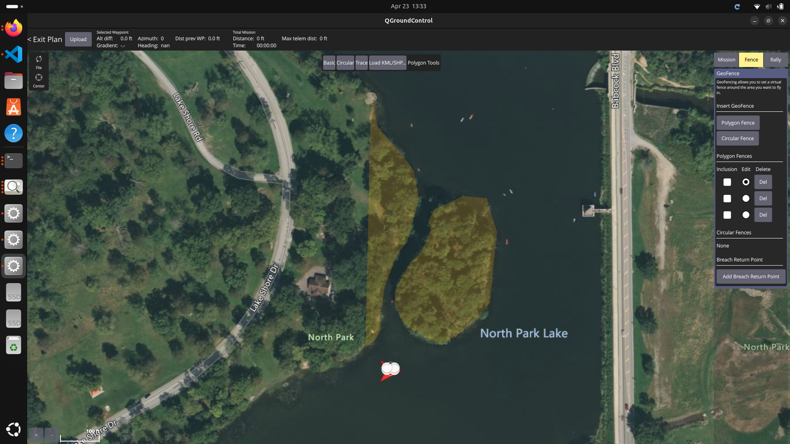

### Create waypoint program
1. Create a waypoint mission to navigate through the channel. <br />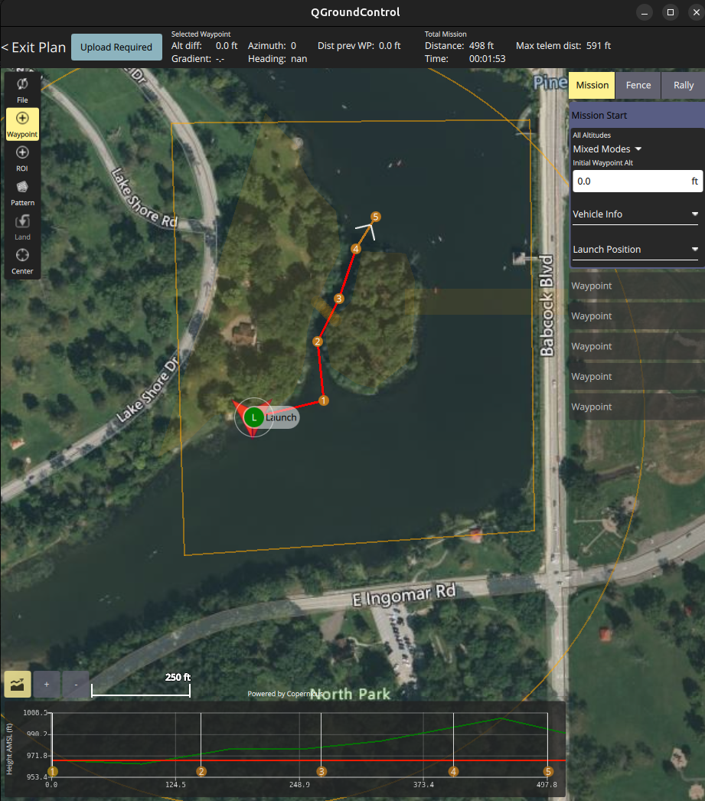
2. Upload it to the robot.
3. Exit "Plan Flight."

### Run the mission
1. Run the mission and monitor the robot.
2. When your robot cannot path through the buoys, change the flight mode to Manual and enter the buoy's exclusion zone.
3. When you enter, the flight mode will automatically switch to Hold for safety. Switch it back to Manual and drive through.
4. When you exit the zone, change the flight mode back to Auto.
5. After your mission is complete, try to come back through the channel.
