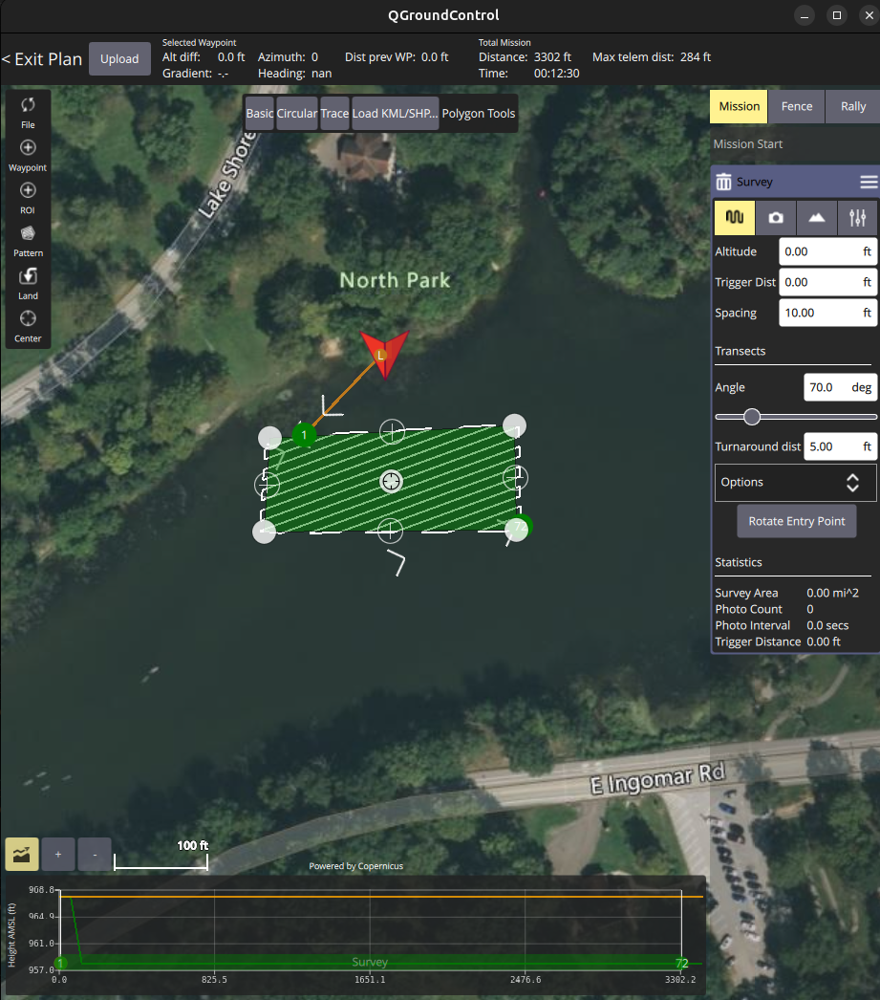

## Mission 3: Underwater mapping
Enable autonomous data collection over a relatively clear lakebed using a lawnmower pattern and side-scan sonar.

## Setup
1. Stop the simulation (See [Stopping the simulation](https://github.com/cmroboticsacademy/gazebosim_blueboat_ardupilot_sitl/blob/main/ReadMe_CMRA.md) section)
2. Start the simulation with the following launch commands. Close QGroundControl before doing so.
   1. Gazebo (Press play before next step)
   ```bash
   ros2 launch move_blueboat mission3_sim.launch.py
   ```
   <details>
   <summary>RViz</summary>

   RViz (ROS Visualization) is a 3D tool in ROS for displaying sensor data and spatial information in real time. It helps you see how your robot or vehicle interprets its environment by visualizing elements such as transforms (TF), maps, and point clouds. Rather than processing data itself, RViz serves as a debugging and validation tool, allowing you to confirm that sensors are aligned correctly and that incoming data makes sense within a shared coordinate frame.

   When using a bathymetric LiDAR to scan the ocean floor, the sensor outputs depth measurements that can be represented as a 3D point cloud. In RViz, this appears as a PointCloud2, where each point corresponds to a spot on the seabed. As your vehicle moves, these scans can be accumulated into a larger map, giving you a detailed view of underwater terrain. Proper TF alignment and filtering are important for removing noise and ensuring the map builds accurately over time.

   </details>

   2. ArduPilot
   ```bash
   sim_vehicle.py -v Rover -f gazebo-rover --model JSON \
      --add-param-file=../gz_ws/cmra_boat.params -w \
      -l 40.595009,-79.99974,0,0 \
      --out=udp:127.0.0.1:14550 --out=udp:127.0.0.1:14551
   ```
   3. QGroundControl
   ```bash
   ./QGroundControl-x86_64.AppImage
   ```
4. Open and Load <b>mission3.plan</b> in QGroundControl.
   
### Mission3 plan
This plan only provides an excusion zone for the dock.

### Create a Survey.

1. Go to Plan View.
2. Click <b>Patten</b>. Select <b>Survey</b>
3. Click <b>Basic</b> to get a rectangle pattern.
4. Adjust the plan to cover the area south of the launch location. <br />
5. Upload Plan
6. Exit Plan

### Running the Survey.
1. Manually drive away from the dock.
2. Change mode to Auto (B).
3. Monitor RViz to see the scan.
