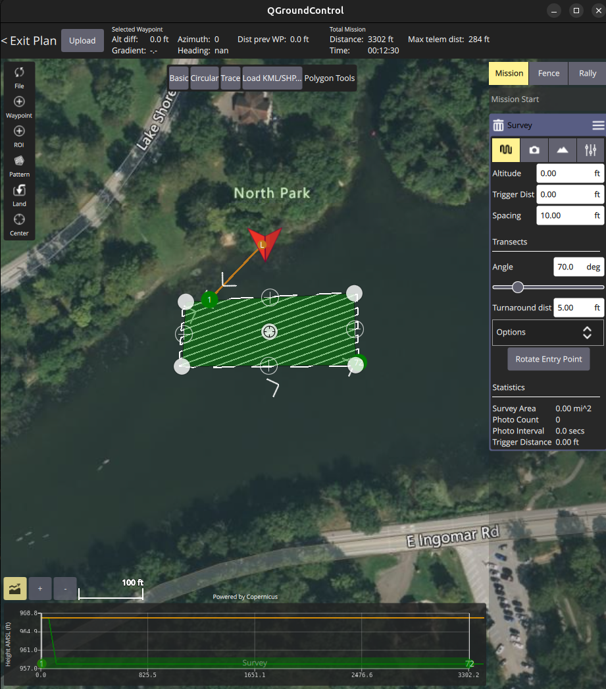

## Mission 3: Underwater mapping
Enable autonomous data collection over a relatively clear lakebed using a lawnmower pattern and side-scan sonar.

## Workstation preparation
1. Open 3 terminal windows. Press `win_key`, start typing `terminal`. Open the application when it appears. To open another terminal window, right-click the terminal app icon on the left toolbar. Select `New Window`.
2. Recommended: Use the layout below
   
    <b>T1</b> Gazebo terminal <br/>
    <b>T2</b> ArduPilot terminal <br />
    <b>T3</b> QGroundControl terminal <br />


## Starting the Docker container
Perform these steps in <b>T1 (Gazebo Terminal)</b>.
1. In <b>T1</b> navigate to the project's Docker folder. <br />
   <details>
   <summary>Linux Tip!</summary>
   
   Use keyboard shortcuts to copy and paste inside terminals. Press `ctl + shift + c` to copy and `ctl + shift + v` to paste.     You can also right-click and copy or paste if that is easier for you.
   </details>

   ```bash
    cd cmra_sim/gazebosim_blueboat_ardupilot_sitl/blueboat_sitl/docker/
    ```
   <details>
   <summary>What is the cd command?</summary>

   The cd (change directory) command is used in a terminal or command prompt to navigate between folders in a file system. It lets you move into a specific directory, go back to a previous one, or return to your home directory, depending on the path you provide.
   
   Wherever you navigate to is considered your working directory. Many commands in Linux run scripts. It is easier to launch scripts when your terminal's working directory is the same location as the script you want to launch. 

   In this step, we are changing our working directory to the project's Docker folder. This is where the Docker launch files live.
   

   </details>
2. In <b>T1</b> start the docker container by executing the run script. <b>This command will prompt you for a password. Ask the instructor for the password to continue.</b>
    ```bash
    sudo ./run.sh
    ```
   <details>
   <summary>What is the sudo ./run command?</summary>
   
   `sudo ./run.sh` means “run the `run.sh` shell script as the superuser. `sudo` gives the command elevated privileges, which this repo needs because `run.sh` launches Docker with privileged options, host networking, GPU access, device mounts, and X11 display forwarding for Gazebo, all of which often require admin-level access on Linux.

   A `.sh` file is a shell script: a text file full of terminal commands. When you run `./run.sh`, the `./` tells the shell to execute the script from the current folder, and this particular script is set up to run with Bash.

   In this project specifically, `run.sh` prepares X11 authentication, sets local paths for `gz_ws` and `SITL_Models`, and then starts a Docker container named `blueboat_sitl` with mounted volumes, host networking, NVIDIA GPU support, and the image `blueboat_sitl:latest`.

    You should see the following output:
    ```
    cmra@cmra-LOQ-15IRX9:~/cmra_sim/gazebosim_blueboat_ardupilot_sitl/blueboat_sitl/docker$ sudo ./run.sh
    [sudo] password for cmra: 
    xauth:  file /tmp/.docker.xauth does not exist
    blueboat_sitl@cmra-LOQ-15IRX9:~/colcon_ws$
    ```
   </details>


### Prepare Gazebo terminal
1. In <b>T1 (Gazebo Terminal)</b> navigate to the `gz_ws` folder
   ```bash
   cd ../gz_ws/
   ```
   <details>
   <summary>What does ../ mean?</summary>
   
   `../` means go back one folder in a path.

   For this step, we need to change our working directory to `gz_ws/` (Gazebo Workspace). This folder contains the scripts to launch Gazebo. When you launch Docker, it changes your working directory to Docker's colcon folder. We need to navigate back one folder to where `gz_ws/` lives. This is why we add `../` to the path.
   
   

   </details>

### Prepare ArduPilot terminal
In this section, you will enter the Docker container in <b>T2 (ArduPilot Terminal)</b>

1. In <b>T2</b> enter the docker container.
   ```bash
   sudo docker exec -it blueboat_sitl /bin/bash
   ```
   <details>
   <summary>What is the sudo docker exec -it blueboat_sitl /bin/bash command?</summary>

   `sudo docker exec -it blueboat_sitl /bin/bash` runs a command inside an already running Docker container with elevated privileges. The `sudo` ensures you have permission to interact with Docker, while `docker exec` tells Docker to execute the `blueboat_sitl` container environment.

   The `-it` flags make the session interactive (so you can type commands), and `/bin/bash` starts a Bash shell inside the container. In this repo’s context, this lets you “enter” the running `blueboat_sitl` simulation container to inspect files, run commands, or debug the Gazebo/ArduPilot SITL environment from the inside.

   

   </details>

2. In <b>T2</b> navigate to the ArduPilot folder
   ```bash
   cd ../ardupilot
   ```
   <details>
   <summary>Linux Tip!</summary>

   You can clear your terminal's log by using the `reset` command. This will delete all previous logs inside of your terminal. It will put you back into the same working directory.
   </details>
   
   

   
## Setup
1. Stop the simulation (See [Stopping the simulation](https://github.com/cmroboticsacademy/gazebosim_blueboat_ardupilot_sitl/blob/main/ReadMe_CMRA.md) section)
2. Start the simulation with the following launch commands. Close QGroundControl before doing so.
   1. Gazebo (Press play before next step)
   ```bash
   ros2 launch move_blueboat mission3_sim.launch.py
   ```
   <details>
   <summary>RViz</summary>

   RViz (ROS Visualization) is a 3D tool in ROS for displaying sensor data and spatial information in real time. It helps you see how your robot or vehicle interprets its environment by visualizing elements such as transforms (TF), maps, and point clouds. Rather than processing data itself, RViz serves as a debugging and validation tool, allowing you to confirm that sensors are aligned correctly and that incoming data makes sense within a shared coordinate frame.

   When using a bathymetric LiDAR to scan the ocean floor, the sensor outputs depth measurements that can be represented as a 3D point cloud. In RViz, this appears as a PointCloud2, where each point corresponds to a spot on the seabed. As your vehicle moves, these scans can be accumulated into a larger map, giving you a detailed view of underwater terrain. Proper TF alignment and filtering are important for removing noise and ensuring the map builds accurately over time.

   </details>

   2. ArduPilot
   ```bash
   sim_vehicle.py -v Rover -f gazebo-rover --model JSON \
      --add-param-file=../gz_ws/cmra_boat.params -w \
      -l 40.595009,-79.99974,0,0 \
      --out=udp:127.0.0.1:14550 --out=udp:127.0.0.1:14551
   ```
    3. Change to the QGroundControl Directory in <b>T3 (QGroundControl Terminal)</b>
   ```
   cd QGroundControl/
   ```
   4. Launch QGroundControl
   ```bash
   ./QGroundControl-x86_64.AppImage
   ```
   5. Open and load <b>mission3</b> in QGroundControl.
   
### Mission3 plan
This plan only provides an exclusion zone for the dock.

### Create a Survey.

1. Go to Plan View.
2. Click <b>Patten</b>. Select <b>Survey</b>
3. Click <b>Basic</b> to get a rectangle pattern.
4. Adjust the plan to cover the area south of the launch location. <br />
5. Upload Plan
6. Exit Plan

### Running the Survey.
1. Manually drive away from the dock.
2. Change mode to Auto (B).
3. Monitor RViz to see the scan.
