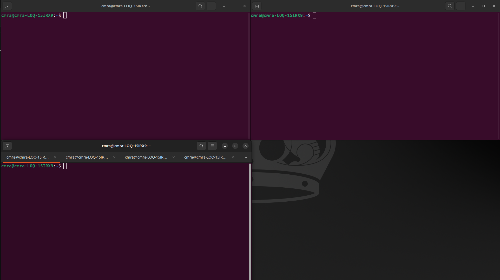

## Mission 4: SWARM mapping
Control 4 blueboats to scan the lake and find hazzardess materials.

## Workstation preparation
1. Open 3 terminal windows. Press `win_key`, start typing `terminal`. Open the application when it appears. To open another terminal window, right-click the terminal app icon on the left toolbar. Select `New Window`.
2. Recommended: Use the layout below
   
    <b>T1</b> Gazebo terminal <br/>
    <b>T2</b> ArduPilot terminal <br />
    <b>T3</b> QGroundControl terminal <br />
3. Add three more tabs to **T2 Ardupilot terminal by clicking add tab.
  
4. Your final layout will look like this.
  


## Launch QGroundControl
1. Change to the QGroundControl Directory in <b>T3 (QGroundControl Terminal)</b>
   ```
   cd QGroundControl/
   ```
2. Launch QGroundControl
   ```bash
   ./QGroundControl-x86_64.AppImage
   ```
3. Open and load <b>mission3</b> in QGroundControl.

### Prepare Gazebo terminal
1. In <b>T1 (Gazebo Terminal)</b> navigate to the `gz_ws` folder
   ```bash
   cd ../gz_ws/
   ```
   <details>
   <summary>What does ../ mean?</summary>
   
   `../` means go back one folder in a path.

   For this step, we need to change our working directory to `gz_ws/` (Gazebo Workspace). This folder contains the scripts to launch Gazebo. When you launch Docker, it changes your working directory to Docker's colcon folder. We need to navigate back one folder to where `gz_ws/` lives. This is why we add `../` to the path.
   
   

   </details>

### Prepare ArduPilot terminals
In this section, you will enter the Docker container in <b>T2 (ArduPilot Terminal)</b>

1. In <b>T2</b> enter the docker container.
   ```bash
   sudo docker exec -it blueboat_sitl /bin/bash
   ```
   <details>
   <summary>What is the sudo docker exec -it blueboat_sitl /bin/bash command?</summary>

   `sudo docker exec -it blueboat_sitl /bin/bash` runs a command inside an already running Docker container with elevated privileges. The `sudo` ensures you have permission to interact with Docker, while `docker exec` tells Docker to execute the `blueboat_sitl` container environment.

   The `-it` flags make the session interactive (so you can type commands), and `/bin/bash` starts a Bash shell inside the container. In this repo’s context, this lets you “enter” the running `blueboat_sitl` simulation container to inspect files, run commands, or debug the Gazebo/ArduPilot SITL environment from the inside.

   

   </details>
2. In <b>T2</b> navigate to the ArduPilot folder
   ```bash
   cd ../ardupilot
   ```
   <details>
   <summary>Linux Tip!</summary>

   You can clear your terminal's log by using the `reset` command. This will delete all previous logs inside of your terminal. It will put you back into the same working directory.
   </details>
   
   
3. Repeat these steps for each tab in the terminal window.

## Launch the simulation
1. Start the simulation with the following launch commands. Close QGroundControl before doing so.
   1. Gazebo (Press play before next step)
   ```bash
   ros2 launch move_blueboat mission4_sim.launch.py
   ```
   <details>
   <summary>RViz</summary>

   RViz (ROS Visualization) is a 3D tool in ROS for displaying sensor data and spatial information in real time. It helps you see how your robot or vehicle interprets its environment by visualizing elements such as transforms (TF), maps, and point clouds. Rather than processing data itself, RViz serves as a debugging and validation tool, allowing you to confirm that sensors are aligned correctly and that incoming data makes sense within a shared coordinate frame.

   When using a bathymetric LiDAR to scan the ocean floor, the sensor outputs depth measurements that can be represented as a 3D point cloud. In RViz, this appears as a PointCloud2, where each point corresponds to a spot on the seabed. As your vehicle moves, these scans can be accumulated into a larger map, giving you a detailed view of underwater terrain. Proper TF alignment and filtering are important for removing noise and ensuring the map builds accurately over time.

   This sensor simulates a multibeam echosounder. https://en.wikipedia.org/wiki/Multibeam_echosounder

   </details>
   TODO - note seed number

2. Go to your first tab in the Ardupilot terminal
3. Launch robots 1 at a time. Wait until the robot connects to QGroundControl before launching another.
   1. TAB 1
   ```bash
   sim_vehicle.py -v Rover -f gazebo-rover --model JSON \
    --add-param-file=../gz_ws/cmra_boat.params \
    --add-param-file=../gz_ws/cmra_boat1_sysid.params \
    -w -I0 --no-extra-ports \
    -l 40.595009,-79.99974,0,0 \
    --out=udp:127.0.0.1:14550
   ```
   2. TAB 2
   ```bash
   sim_vehicle.py -v Rover -f gazebo-rover --model JSON \
    --add-param-file=../gz_ws/cmra_boat.params \
    --add-param-file=../gz_ws/cmra_boat2_sysid.params \
    -w -I1 --no-extra-ports \
    -l 40.595009,-79.99974,0,0 \
    --out=udp:127.0.0.1:14550
    ```
    3. TAB 3
    ```bash
    sim_vehicle.py -v Rover -f gazebo-rover --model JSON \
    --add-param-file=../gz_ws/cmra_boat.params \
    --add-param-file=../gz_ws/cmra_boat3_sysid.params \
    -w -I2 --no-extra-ports \
    -l 40.595009,-79.99974,0,0 \
    --out=udp:127.0.0.1:14550
    ```
    4. TAB 4
    ```bash
    sim_vehicle.py -v Rover -f gazebo-rover --model JSON \
      --add-param-file=../gz_ws/cmra_boat.params \
      --add-param-file=../gz_ws/cmra_boat4_sysid.params \
      -w -I3 --no-extra-ports \
      -l 40.595009,-79.99974,0,0 \
      --out=udp:127.0.0.1:14550
    ```
  <details>
   <summary>Multi Robot Launch Commands</summary>

   In each tab, you are launching an instance of Ardupilot. Each instance conntects to QGroundControl seperatly. QGroundControl knows which robot is which becuase we provide it an ID in the launch arguments. `-I0` in the first launch command defines the vehicle as vehicle 0. 
   </details>

## QGroundControl Selecting a robot with multiple.
When you have multiple robots connected at the same time, you will need to arm, plan, and execute missions one robot at a time.

You can select the robot you want to control with the multirobot dropdown.


## Open Mission 4 plan on Vehicle 4
Mission 4 plan includes 32 buoys. They are in sets of 4. Each set creates a box. Inside this box there are atleast 1 hazzardes materials. 
1. Select Vehicl 4 in the robot dropdown in QGroundControl
2. Open Plan View
3. File Open mission4.plan
   
## Create Exlusion Zone and Survey
1. Create an exlusion zone for your coast
2. Save the map as a new plan
   1. File Save as
   2. Name it mission4_yourName.plan
3. Add a survey pattern where you want your first robot to scan
4. Updaload the mission
5. Exit Plan

## Deploy your Vehicle 4
1. Make sure you are still selected on vehicle 4
2. Arm the robot in Manual
3. Drive away from the dock using the controller
4. Change modes to auto and confirm robot is able to carry out mission (EKF must clear failsafe first)
   
## Plan mission for next vehicle.
1. Select another vehicle in the drop down.
2. Open plan view
3. Open the plan you saved mission4_yourName.plan
4. Add surevey mission to robot
5. Upload plan
6. Deploy robot
7. Repeat these steps for the reminaing robots

