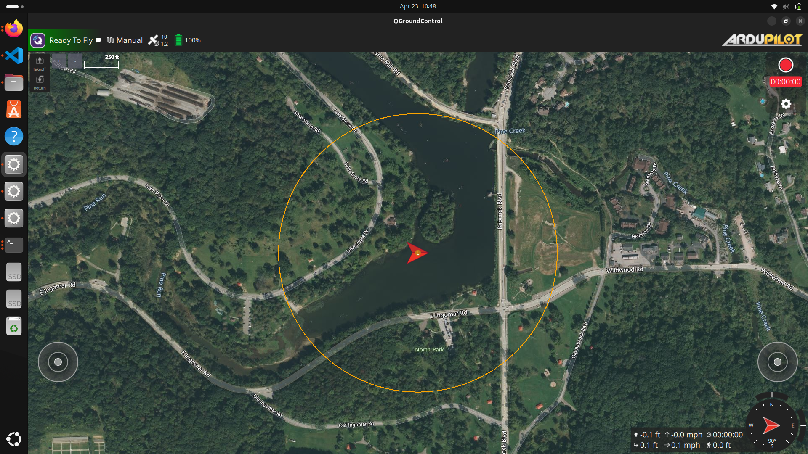

# Missions
## Mission 0 - Mission 0: Software Setup and Manual Un-docking
Learn and practice the steps to start up the simulation. Understand the relationship between the simulator setup and the real-world hardware and software configuration. Verify the vehicle responds by manually driving it away from the dock, then back.

### Setup
1. Complete steps in [System Overview -  Setup and Running](https://github.com/cmroboticsacademy/gazebosim_blueboat_ardupilot_sitl/blob/main/ReadMe_CMRA.md)

### QGroundControl Overview

###  Manual Un-docking
1. Arm your robot by clicking on the message icon (upper left). This will expand, and you will see an Arm button.
2. Click the Arm button.
3. Confirm the Arm command by holding space or sliding the actuator in the center of the screen.
4. Use the left virtual joystick to drive the boat forward and backward. Use the right virtual joystick to steer.
5. Drive the boat, monitor the battery, and take note of the experience.

### Simple Waypoint Mission in QGroundControl
QGroundControl can send a waypoint plan to ArduPilot. ArduPilot uses that plan to navigate the boat to each waypoint.
1. Click the top left icon in QGroundControl (looks like a Q)
2. Select Plan Flight
3. Select Empty Plan
4. Click the Waypoint button on the left menu bar
5. Add waypoints by clicking on the map.
6. When you add waypoints, they will appear on the right menu bar next to the map. If you need to edit or delete waypoints, select them by clicking on them.
7. Adjust the launch / RTL location by selecting the Mission Start node in the left menu above your waypoints.
8. Once selected, click and drag the "launch" pin on the map to the desired launch / RTL position.
9. When ready to execute the plan, click Upload or Upload Required in the top left of the application. 
10. After the plan is uploaded, click Exit Plan.
11. Hold space or slide the actuator to start the waypoint plan.
