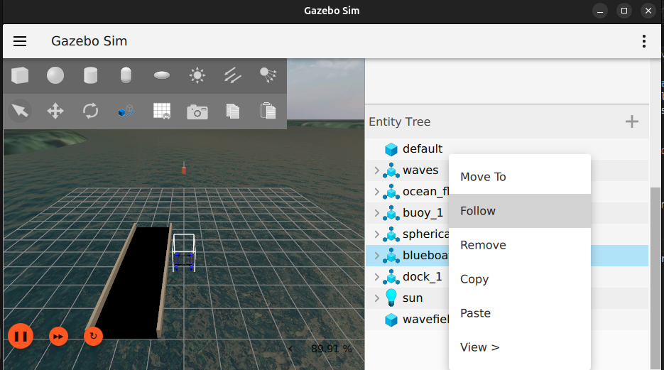

### Notes
colcon build --symlink-install --merge-install --cmake-args -DCMAKE_BUILD_TYPE=RelWithDebInfo -DBUILD_TESTING=ON -DCMAKE_CXX_STANDARD=17
Heightmaps run source ~/terrain-venv/bin/activate
# Missions
## Mission 0 - Mission 0: Software Setup and Manual Un-docking
Learn and practice the steps to start up the simulation. Understand the relationship between the simulator setup and the real-world hardware and software configuration. Verify the vehicle responds by manually driving it away from the dock, then back.

### Setup
1. Complete steps in [System Overview -  Setup and Running](https://github.com/cmroboticsacademy/gazebosim_blueboat_ardupilot_sitl/blob/main/ReadMe_CMRA.md)

###  Manual Un-docking
All steps should be performed inside QGroundControl unless otherwise stated.
<b>Arming in manual mode</b>

1. In Gazebo, right-click the blueboat in the Entity Tree. Click Follow. This will make the camera follow the Blueboat while it moves.
  
2. In <b>T2 (ArduPilot Terminal)</b>, confirm your robot is ready to be armed. When you see `AP: AHRS: EKF3 active` in the log, your robot is ready. You should see output similar to this.
```bash
AP: EKF3 IMU0 tilt alignment complete
AP: EKF3 IMU1 tilt alignment complete
AP: EKF3 IMU0 MAG0 initial yaw alignment complete
AP: EKF3 IMU1 MAG0 initial yaw alignment complete
AP: GPS 1: detected as u-blox at 230400 baud
AP: EKF3 IMU0 origin set
AP: EKF3 IMU1 origin set
AP: Field Elevation Set: 0m
AP: EKF3 IMU0 is using GPS
AP: EKF3 IMU1 is using GPS
AP: AHRS: EKF3 active
```

2. Set your flight mode to manual by clicking the current flight mode and selecting Manual in the dropdown. (Your robot may already be set to Manual mode).

3. Arm your robot by opening the Arm/Console menu and clicking arm

4. Confirm the Arm command by holding space or sliding the actuator in the center of the screen.
    <details>

    <summary>Failed to arm?</summary>

    Before the robot arms, it goes through a series of checks. If one of the checks fails, the robot fails to arm. In the simulator, it is most likely due to two causes.
    1. You did not wait until EKF3 is active. You'll see errors stating you did not set the AHRS mode.
    2. The computer is running too slow to consistently send sensor data to ArduPilot, and will take a little longer to calibrate its position and satisfy all of the arming checks.
        
    If this happens to you, wait until your robot status says "Ready to Fly" and is green. Confrim EFK3 is Active, and rearm.

    </details>

5. Use the left virtual joystick to drive the boat forward and backward. Use the right virtual joystick to steer.

`

6. Drive the boat, monitor the battery, and take note of the experience.

## Mission 1a: Buoy and Back
Program a simple autonomous mission to go around a buoy and return.

### Setup
1. If your mission is still running from mission 0, ignore the next step.
2. Start/Restart the simulation with the following launch commands. Close QGroundControl
   1. Gazebo (Press play before next step)
   ```
   ros2 launch move_blueboat level1_sim.launch.py
   ```
   2. ArduPilot
   ```
   sim_vehicle.py -v Rover -f gazebo-rover --model JSON \
      --add-param-file=../gz_ws/cmra_boat.params -w \
      -l 40.595009,-79.99974,0,0 \
      --out=udp:127.0.0.1:14550 --out=udp:127.0.0.1:14551
   ```
   3. QGroundControl
   ```
   ./QGroundControl-x86_64.AppImage /home/cmra/Documents/QGroundControl/Missions/level1.plan
   ```

### Creating a waypoint mission
1. Click the QGroundControl menu icon and select "Plan Flight."
   
2. Zoom in on your robot in the map area by scrolling or pressing the + or - buttons.
3. Click the waypoint button in the left menu bar.
   
4. Click an area on the map to add a waypoint.
    
5. Place multiple waypoints (as many as you want)
6. 
7. Adjust your Mission Start position.
   1. Click the Mission Start node on the right side menu
   
   2. Click "Launch Position" and set it to 0ft.
   3. Drag the green Launch point in line with your robot.
    
8. Upload your mission to ArduPilot by clicking Upload Required
    
9. Click "Exit Plan" after upload.

### Running a waypoint mission.
1. QGroundControl will automatically prompt you to arm and start the mission. You can only do this if there are no fences around your robot.
   1. Set flight mode to Manual.
   2. Arm the robot using the menu, and slide the confirmation.
   3. Once armed, manually drive away from the dock.
   4. Once you clear the dock, change the flight mode to Auto.
   5. Confirm Mission start if prompted.
2. Your robot should now be carrying out the mission.
<details>

<summary>Robot enters buoy's exclusion zone.</summary>
If the robot enters the exclusion zone, it will automatically go into hold mode. You can switch the mode back to Auto if the robot drifts out of the zone. If the robot gets stuck in the zone, switch the flight mode to Manual, drive it out of the zone, then switch back to auto.
</details>

<details>
<summary>The robot is stuck outside of an exclusion zone.</summary>
Your robot might not have a valid path to follow because it is too close to an exclusion zone. This can happen when you are close to the dock or buoy. Change your flight mode to manual and drive away from the zone. When far enough away, change it back to Auto.
</details>


After the mission is complete, you can change your flight mode to RTL (Return to Launch). This will return directly to the launch point. You can also use SmartRTL, which will come back to the launch point the way it came.


## Mission 1b: Monitoring the vehicle
Proceed to implement a second simple-looking waypoint course independently. Monitor the vehicle during operation. The vehicle will experience course drift due to a current. Enable corrections in autonomy settings. Re-engage and complete mission.

### Setup
1. Stop the simulation (See [Stopping the simulation](https://github.com/cmroboticsacademy/gazebosim_blueboat_ardupilot_sitl/blob/main/ReadMe_CMRA.md) section)
2. Start the simulation with the following launch commands. Close QGroundControl before doing so.
   1. Gazebo (Press play before next step)
   ```
   ros2 launch move_blueboat level2_sim.launch.py
   ```
   2. ArduPilot
   ```
   sim_vehicle.py -v Rover -f gazebo-rover --model JSON \
      --add-param-file=../gz_ws/cmra_boat.params -w \
      -l 40.594988,-79.999149,0,0 \
      --out=udp:127.0.0.1:14550 --out=udp:127.0.0.1:14551
   ```
   3. QGroundControl
   ```
   ./QGroundControl-x86_64.AppImage /home/cmra/Documents/QGroundControl/Missions/level2.plan
   ```
### Create and Run Mission
3. Create a waypoint program. See Mission 1a for instructions.
4. Run your mission and monitor the robot. Take note of the changes now that there are waves.

<details>
<summary>The robot will not arm.</summary>
Because of the waves, it takes a while for EFK3 to become active. Wait for the activation log before arming.
</details>

<details>
<summary>How to prevent the robot from drifting when stopped?</summary>
If you set your flight mode to "Loiter," the robot will use its motors to stay in the same place. This is useful if there is a heavy current, like in this mission.
</details>

## Mission 2a: Channel
Plan a mission sequence around an island. Use exclusion zones to keep the vehicle away from known navigational hazards.

### Setup
1. Stop the simulation (See [Stopping the simulation](https://github.com/cmroboticsacademy/gazebosim_blueboat_ardupilot_sitl/blob/main/ReadMe_CMRA.md) section)
2. Start the simulation with the following launch commands. Close QGroundControl before doing so.
   1. Gazebo (Press play before next step)
   ```
   ros2 launch move_blueboat level3_sim.launch.py
   ```
   2. ArduPilot
   ```
   sim_vehicle.py -v Rover -f gazebo-rover --model JSON \
      --add-param-file=../gz_ws/cmra_boat.params -w \
      -l 40.594988,-79.999149,0,0 \
      --out=udp:127.0.0.1:14550 --out=udp:127.0.0.1:14551
   ```
   3. QGroundControl
   ```
   ./QGroundControl-x86_64.AppImage /home/cmra/Documents/QGroundControl/Missions/level3.plan
   ```

### Creating a GEO Fence
1. Create a plan by going to Plan Flight in QGroundControl.
2. Zoom your map out so you can see most of the lake.
3. Click "Fence" on the left menu

4. Click Polygon Fence
5. Fence off the west coast of the lake with the fence.

6. Uncheck "Inclusion" for this fence.

7. Add another Polygon Fence for the east coast, and uncheck "Inclusion."


### Create and run a waypoint mission.
1. Click Mission in the Plan Flight View.
2. Click Waypoint to add waypoints.
3. Use a single waypoint to navigate to the other side of the lake, and adjust the launch position.

4. Upload the mission.
5. Exit "Plan Flight."
6. Run the waypoint mission.
7. Monitor the robot. You may need to manually take over if the robot gets stuck.

## Mission 2b: Narrow Channel
Recognize, plan for, and run a mission in which a portion of the route is known to be too narrow and may require manual control

### Setup
1. Stop the simulation (See [Stopping the simulation](https://github.com/cmroboticsacademy/gazebosim_blueboat_ardupilot_sitl/blob/main/ReadMe_CMRA.md) section)
2. Start the simulation with the following launch commands. Close QGroundControl before doing so.
   1. Gazebo (Press play before next step)
   ```
   ros2 launch move_blueboat level4_sim.launch.py
   ```
   2. ArduPilot
   ```
   sim_vehicle.py -v Rover -f gazebo-rover --model JSON \
      --add-param-file=../gz_ws/cmra_boat.params -w \
      -l 40.594988,-79.999149,0,0 \
      --out=udp:127.0.0.1:14550 --out=udp:127.0.0.1:14551
   ```
   3. QGroundControl
   ```
   ./QGroundControl-x86_64.AppImage /home/cmra/Documents/QGroundControl/Missions/level4.plan
   ```

### Create GEO Fence
1. Create a plan with two Polygon GEO Fences. Position them so you can drive through the narrow channel between the west coast and the island.
   

### Create waypoint program
1. Create a waypoint mission to navigate through the channel.
    
2. Upload it to the robot.
3. Exit "Plan Flight."

### Run the mission
1. Run the mission and monitor the robot.
2. When your robot cannot path through the buoys, change the flight mode to Manual and enter the buoy's exclusion zone.
3. When you enter, the flight mode will automatically switch to hold for safety. Switch it back to Manual and drive through.
4. When you exit the zone, change the flight mode back to Auto.
5. After your mission is complete, try to come back through the channel.
straight

## Mission 3: Underwater mapping
Enable autonomous data collection over a relatively clear lakebed using a lawnmower pattern and side-scan sonar.

## Setup
1. Stop the simulation (See [Stopping the simulation](https://github.com/cmroboticsacademy/gazebosim_blueboat_ardupilot_sitl/blob/main/ReadMe_CMRA.md) section)
2. Start the simulation with the following launch commands. Close QGroundControl before doing so.
   1. Gazebo (Press play before next step)
   ```
   ros2 launch move_blueboat level5_sim.launch.py
   ```
   <details>
   <summary>RVIZ</summary>

   RViz (Robot Visualization) is a 3D tool in ROS used to display sensor data and spatial information in real time. It helps    you see how your robot or vehicle interprets its environment by visualizing elements such as transforms (TF), maps, and point clouds. Rather than processing data itself, RViz acts as a debugging and validation tool, letting you confirm that sensors are aligned correctly and that incoming data makes sense in a shared coordinate frame.

   When using a bathymetric LiDAR to scan the ocean floor, the sensor outputs depth measurements that can be represented as a 3D point cloud. In RViz, this appears as a PointCloud2, where each point corresponds to a spot on the seabed. As your vehicle moves, these scans can be accumulated into a larger map, giving you a detailed view of underwater terrain. Proper TF alignment and filtering are important for removing noise and ensuring the map builds accurately over time.

   </details>

   2. ArduPilot
   ```
   sim_vehicle.py -v Rover -f gazebo-rover --model JSON \
      --add-param-file=../gz_ws/cmra_boat.params -w \
      -l 40.594988,-79.999149,0,0 \
      --out=udp:127.0.0.1:14550 --out=udp:127.0.0.1:14551
   ```
   3. QGroundControl
   ```
   ./QGroundControl-x86_64.AppImage /home/cmra/Documents/QGroundControl/Missions/level4.plan
   ```
