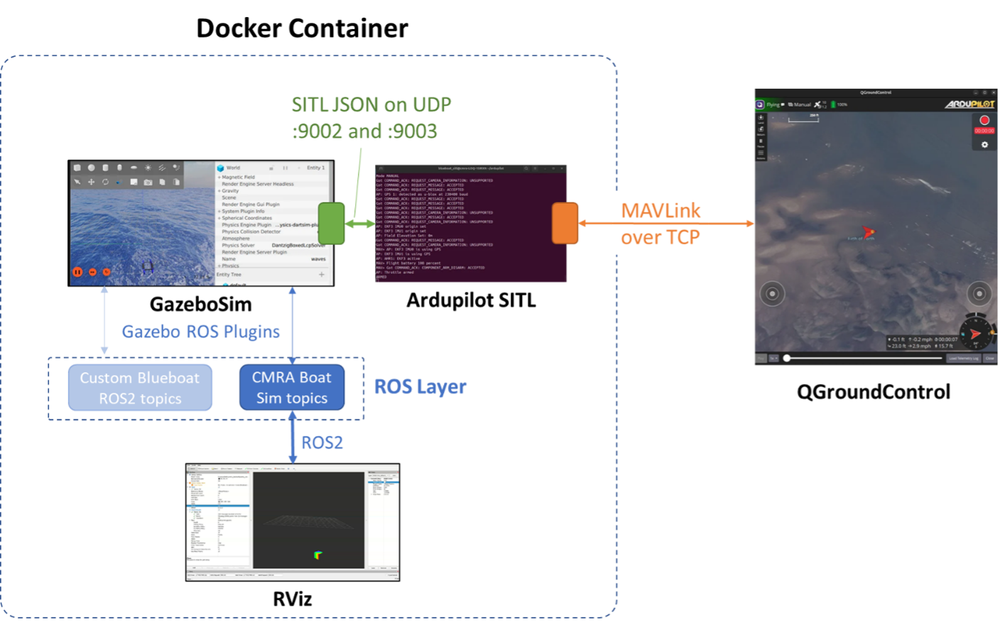
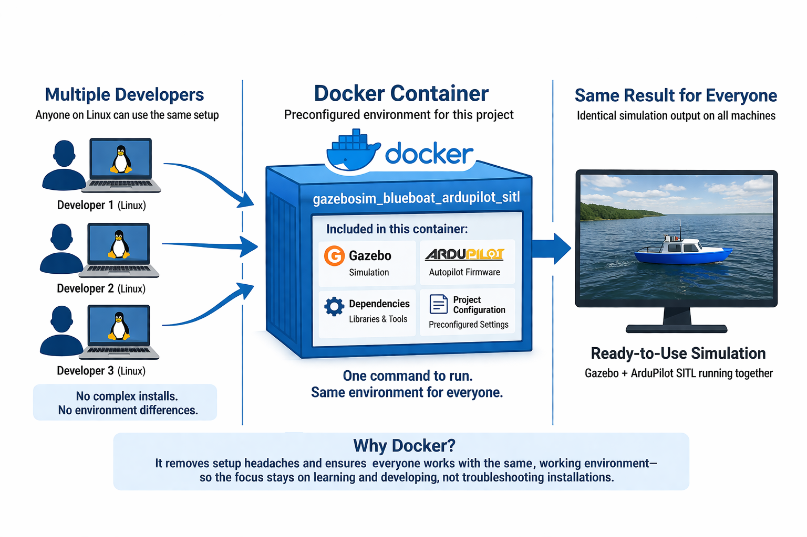
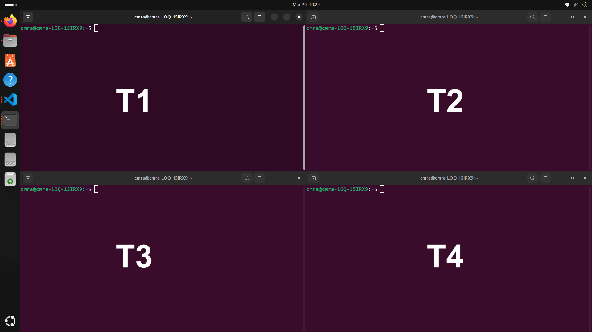
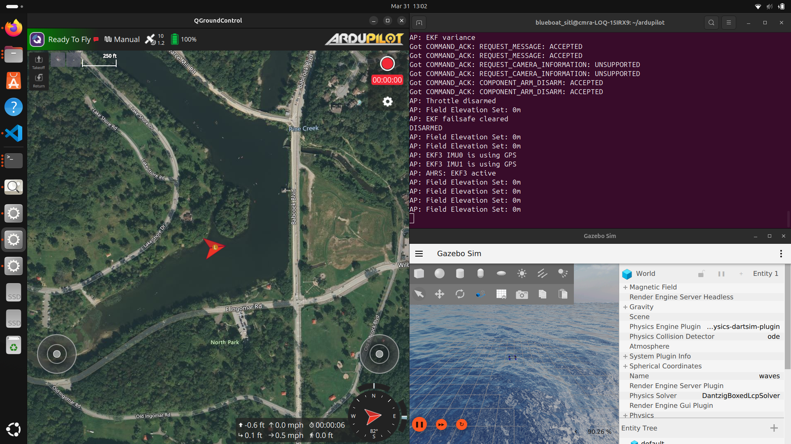

# System overview
The USV simulator in this module is structured to familiarize you with software architectures used in real-world autonomous systems. Unlike off-the-shelf flight simulation games, these are rarely single, self-contained applications. Instead, they consist of multiple software components that must be configured to communicate properly with each other.

Not all real-world platforms require or permit you to access these layers, even for troubleshooting. Newer platforms undergoing rapid improvement tend to expose more of these features to the end user (you). Regardless, this module should give you some insight into how software systems on larger platforms are structured and maintained.

## Major components

There are four major software components in this system, including the physics simulator.

- <b>QGroundControl</b> is the Ground Control Station (GCS) software. It is the primary user interface that you would see on your laptop or control station.
- <b>ArduPilot</b> is the autopilot firmware running on board the vehicle. It calculates the necessary settings for the vehicle’s motors and control surfaces to carry out high-level navigation commands such as moving to a waypoint, then issues commands to low-level motor controllers accordingly. It monitors and adjusts those settings with the help of the vehicle’s sensors to keep the vehicle on track until the goal is reached.
    - The autopilot program does not have a user interface, and so is largely invisible. It relies on external sources such as the Ground Control Station (GCS) to convey operator instructions.
- <b>Rviz</b> is the visualization software for the robot’s sensor data. It allows an operator, maintainer, or analyst to view sensor data in a sensible way, such as a 3D map.
    - This generally happens on a separate workstation or in the cloud. For purposes of this training module, however, Rviz will be loaded alongside the rest of the software.
- <b>GazeboSim</b> is the robot simulator. It stands in for both the robot’s body and its physical environment during training or software troubleshooting. It is not used when the robot is actually being deployed.
    - When the autopilot is connected to the simulator, the simulator “talks” to the autopilot just as the real robot would, accepting motor commands and providing sensor feedback. The robot’s body and the world around it are simulated as well, so the motor commands translate into motion, and the sensor feedback reflects what the robot would see under those conditions.
    - Running the robot with all software operating as if for real, but with physics simulation taking the place of the physical world, is called SITL (Software In The Loop) operation.

 


## Docker

Docker is a tool that packages software and everything it needs to run (code, libraries, and settings) into a single unit called a container. This allows the software to run the same way on any computer, avoiding issues caused by differences between systems.

In this Gazebo + ArduPilot project, Docker provides a complete simulation environment with all dependencies already installed. Instead of manually configuring each tool, the container can be run to immediately access a working setup, ensuring consistency and reducing setup errors.

# How to run this project

## Workstation preparation
1. Open 4 terminal windows. Press `win_key`, start typing `terminal`. Open the application when it appears. To open another terminal window, right-click the terminal app icon on the left toolbar. Select `New Window`.
2. Recommended: Use the layout below
   
    <b>T1</b> Gazebo terminal <br/>
    <b>T2</b> ArduPilot terminal <br />
    <b>T3</b> QGroundControl terminal <br />
    <b>T4</b> Misson Uploader terminal <br />


## Starting the Docker container
Perform these steps in <b>T1</b>.
1. In <b>T1</b> navigate to the project's Docker folder. <br />
   <details>
   <summary>Linux Tip!</summary>
   Triple-click the command below to highlight it. `ctrl + c` to copy. In <b>T1</b> use `ctl + shift + v` to paste. You must use the `shift` key for copying and pasting inside terminals. </details>

   ```bash
    cd cmra_sim/gazebosim_blueboat_ardupilot_sitl/blueboat_sitl/docker/
    ```
   <details>
   <summary>What is the cd command?</summary>
   The cd (change directory) command is used in a terminal or command prompt to navigate between folders in a file system. It lets you move into a specific directory, go back to a previous one, or return to your home directory depending on the path you provide.
   </details>
2. In <b>T1</b> start the docker container by executing the run script. <b>This command will prompt you for a password. Ask the instructor for the password to continue.</b>
    ```bash
    sudo ./run.sh
    ```
   <details>
   <summary>What is the sudo ./run command?</summary>
   
   `sudo ./run.sh` means “run the `run.sh` shell script as the superuser. `sudo` gives the command elevated privileges, which this repo needs because `run.sh` launches Docker with privileged options, host networking, GPU access, device mounts, and X11 display forwarding for Gazebo, all of which often require admin-level access on Linux.

   A `.sh` file is a shell script: a text file full of terminal commands. When you run `./run.sh`, the `./` tells the shell to execute the script from the current folder, and this particular script is set up to run with Bash.

   In this project specifically, `run.sh` prepares X11 authentication, sets local paths for `gz_ws` and `SITL_Models`, and then starts a Docker container named `blueboat_sitl` with mounted volumes, host networking, NVIDIA GPU support, and the image `blueboat_sitl:latest`.
   </details>

    You should see the following output:
    ```
    cmra@cmra-LOQ-15IRX9:~/cmra_sim/gazebosim_blueboat_ardupilot_sitl/blueboat_sitl/docker$ sudo ./run.sh
    [sudo] password for cmra: 
    xauth:  file /tmp/.docker.xauth does not exist
    blueboat_sitl@cmra-LOQ-15IRX9:~/colcon_ws$
    ```
   
   


### Prepare Gazebo terminal
1. In <b>T1</b> navigate to the `gz_ws` folder
   ```bash
   cd ../gz_ws
   ```
   <details>
   <summary>What does ../ mean?</summary>
   
   `../` means go back one folder in a path.
   </details>

### Prepare ArduPilot terminal
In this section, you will enter the Docker container in <b>T2</b>

1. In <b>T2</b> enter the docker container.
   ```bash
   sudo docker exec -it blueboat_sitl /bin/bash
   ```
   <details>
   <summary>What is the sudo docker exec -it blueboat_sitl /bin/bash command?</summary>

   `sudo docker exec -it blueboat_sitl /bin/bash` runs a command inside an already running Docker container with elevated privileges. The `sudo` ensures you have permission to interact with Docker, while `docker exec` tells Docker to execute the `blueboat_sitl` container environment.

   The `-it` flags make the session interactive (so you can type commands), and `/bin/bash` starts a Bash shell inside the container. In this repo’s context, this lets you “enter” the running `blueboat_sitl` simulation container to inspect files, run commands, or debug the Gazebo/ArduPilot SITL environment from the inside.
   </details>
2. In <b>T2</b> navigate to the ArduPilot folder
   ```bash
   cd ../ardupilot
   ```
   

## Running the simulation
When running the simulation, you must follow these steps in order. If these steps do not work, see the "Restarting the simulation" section.

Follow this order exactly.
1. Launch the gazebo simulation
2. Start the simulation inside Gazebo
3. Launch ArduPilot

### Launch and run Gazebo Simulation
1. Launch Gazebo
   ```bash
   ros2 launch move_blueboat level1_sim.launch.py
   ```
   <details>
   <summary>What is the ros2 launch move_blueboat level1_sim.launch.py command?</summary>

   `ros2 launch move_blueboat level1_sim.launch.py` is a ROS 2 command used to start a predefined launch configuration for a robot or simulation. The `ros2 launch` part tells ROS 2 to run a launch file, `move_blueboat` is the ROS 2 package name, and `level1_sim.launch.py` is the specific Python-based launch file that defines what nodes, parameters, and processes to start.

   In this project, running this command starts the BlueBoat Gazebo simulation for “level 1,” launching components like Gazebo, robot controllers, and any necessary ROS 2 nodes defined in that launch file so the simulation environment is fully set up and ready to run.
   </details>
2. This will open the simulation window. Allow it to open and load
3. <b>IMPORTANT</b> - Press play and confirm simulation is running before moving on
   

### Launch ArduPilot
1. In <b>T2</b> run the launch command
   ```
   sim_vehicle.py -v Rover -f gazebo-rover --model JSON --map --console \
   -l 40.594988,-79.999149,0,0 \
   --out=udp:127.0.0.1:14550 \
   --out=udp:127.0.0.1:14551
   ```
   <details>
   <summary>What is the sim_vehicle.py -v Rover -f gazebo-rover --model JSON --map --console \
      -l 40.594988,-79.999149,0,0 \
      --out=udp:127.0.0.1:14550 \
      --out=udp:127.0.0.1:14551 command?</summary>

   `sim_vehicle.py` is a script from ArduPilot used to start a Software-In-The-Loop (SITL) vehicle simulation. The flags here specify the vehicle type (`-v Rover`), the simulation environment (`-f gazebo-rover`), and options like using a JSON model, opening a map and console, and setting the starting GPS location with `-l`.

   The `--out=udp:127.0.0.1:14550` and `--out=udp:127.0.0.1:14551` parts send telemetry data over UDP to those ports on your local machine, which allows tools like QGroundControl or other ROS/bridge nodes to connect and interact with the simulated rover in the Gazebo environment.
   </details>

### Launch QGroundControl
1. In <b>T3</b> navigate to the application folder
   ```bash
   cd QGroundControl/
   ```
2. In <b>T3</b> start QGroundControl
   ```bash
   ./QGroundControl-x86_64.AppImage
   ```
   <details>
   <summary>What is the /QGroundControl-x86_64.AppImage command?</summary>

   `./QGroundControl-x86_64.AppImage` runs the QGroundControl application from the current directory. The `./` tells the terminal to execute the file locally, and an `.AppImage` is a self-contained Linux executable that doesn’t need installation.

   QGroundControl is a ground control station used to monitor and control drones/rovers, so in this setup it connects to the simulated vehicle (via the UDP ports from `sim_vehicle.py`) to display telemetry, maps, and allow you to send commands to the BlueBoat or rover simulation.

   </details>

# Operating and maintaining

## Confirming your tech stack is running.
To confirm your tech stack is running, you should see the following:
1. Gazebo sim is running
2. ArduPilot messages are streaming in <b>T2 (ArduPilot terminal)</b>
3. QGroundControl is connected and shows your robot on the map.
   

## Resetting the simulation
You may often need to restart the simulation<. Most of the time, you do not have to rebuild.

1. Click into <b>T1 (Gazebo Terminal)</b> and press `ctl + c`. This will stop the gazebo simulation. If the terminal does not stop processing, press `ctl + c` again until you get a terminal line that you can type into.
2. Do the same for <b>T2 (ArduPilot terminal)</b>
3. After both terminals are stopped, re-run the launch commands. Click into <b>T1</b>. Use the up arrow on your keyboard to load the last executed command. Check that it is the correct launch command, then press Enter.
4. Do the same for <b>T2</b>

Most of the time, you will not have to reset QGroundControl in <b>T3</b>. Follow these steps if needed:
1. Close the QGroundControl Application
2. Click into <b>T3 (QGroundControl)</b>, and press `ctl + c`.
3. Press up to load the last executed command. Confirm it’s correct and press enter.

## Closing the simulation tech stack.
1. Close out of the QGroundControl application
2. Click into <b>T1 (Gazebo terminal)</b>, and press `ctl + c`.
3. Do this for <b>T2 (ArduPilot terminal)</b> and <b>T3 (QGroundControl terminal)</b>.
4. In <b>T1</b> run the exit command
   ```bash
   exit
   ```
5. Do this for <b>T2</b> and if needed <b>T4 (Mission Uploader terminal)</b>

## Gazebo and ArduPilot launch commands
### Mission 1 Gazebo and Ardupilot commands
- Gazebo 
   ```
   ros2 launch move_blueboat level1_sim.launch.py
   ```
- ArduPilot
   ```bash
   sim_vehicle.py -v Rover -f gazebo-rover --model JSON --map --console \
   -l 40.594988,-79.999149,0,0 \
   --out=udp:127.0.0.1:14550 \
   --out=udp:127.0.0.1:14551
   ```
# Missions
## Mission 1 - Setup, Manual Flight, and Waypoints
### Setup
1. Follow the build instructions above to get the tech stack started.
2. Complete Manual Drive in QGroundControl
3. Complete Simple Waypoint Mission in QGroundControl

### Manual Drive in QGroundControl
1. Arm your robot by clicking on the message icon (upper left). This will expand, and you will see an Arm button.
2. Click the Arm button.
3. Confirm the Arm command by holding space or sliding the actuator in the center of the screen.
4. Use the left virtual joystick to drive the boat forward and backward. Use the right virtual joystick to steer.
5. Drive the boat, monitor the battery, and take note of the experience.

### Simple Waypoint Mission in QGroundControl
QGroundControl can send a waypoint plan to ArduPilot. ArduPilot uses that plan to navigate the boat to each waypoint.
1. Click the top left icon in QGroundControl (looks like a Q)
2. Select Plan Flight
3. Select Empty Plan
4. Click the Waypoint button on the left menu bar
5. Add waypoints by clicking on the map.
6. When you add waypoints, they will appear on the right menu bar next to the map. If you need to edit or delete waypoints, select them by clicking on them.
7. Adjust the launch / RTL location by selecting the Mission Start node in the left menu above your waypoints.
8. Once selected, click and drag the "launch" pin on the map to the desired launch / RTL position.
9. When ready to execute the plan, click Upload or Upload Required in the top left of the application. 
10. After the plan is uploaded, click Exit Plan.
11. Hold space or slide the actuator to start the waypoint plan.


